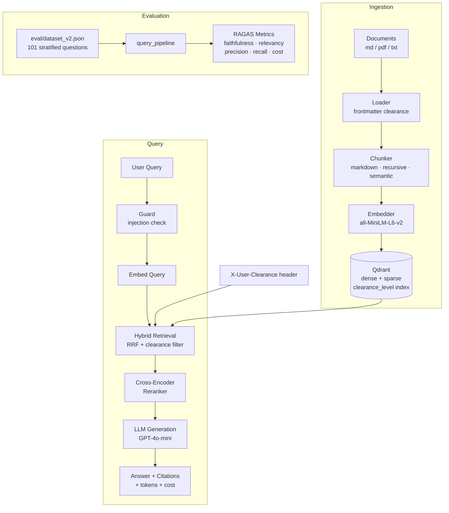

<div align="center">


**Production-ready RAG system for technical documentation.**

[](LICENSE)
[](https://www.python.org/)
[](Dockerfile)
[](https://fastapi.tiangolo.com/)
[](https://qdrant.tech/)
[](eval/results/baseline.json)
[](eval/results/baseline.json)

docquery combines **hybrid search (dense + BM25)**, **cross-encoder reranking**, and **citation-grounded generation** for accurate, verifiable answers from your documentation corpus. Evaluated end-to-end with RAGAS metrics.

</div>

---

## I built this. Then I audited it.

The v1 of docquery had strong foundations: hybrid retrieval, reranking, RAGAS evaluation, idempotent ingest. But "working" and "defensible" are different standards. This sprint closed six measurable gaps:

| Gap | Before | After |
|-----|--------|-------|
| Cost tracking | No visibility into tokens/cost per query | `tokens_in`, `tokens_out`, `cost_usd` in every API response and eval run |
| Gold-set size | 20 questions (low statistical power) | 101 stratified questions: factual, multi-hop, comparative, unanswerable |
| Chunking strategy | Hardcoded Markdown + Recursive | Configurable via `CHUNKER_STRATEGY=markdown\|recursive\|semantic` |
| Prompt injection | No input validation — any payload reached the LLM | Input guard blocks OWASP LLM01/LLM06 patterns at the API boundary |
| RBAC | All documents accessible to all users | `clearance_level` per chunk; `X-User-Clearance` header filters retrieval |
| Self-audit narrative | None | This README |

The tradeoff for hardening instead of starting a new project: six gaps closed in ~1.5 weeks, narrative of "engineer auditing their own work" — which is rarer and more credible in a portfolio than project #N.

---

## Problem

Technical teams accumulate large volumes of documentation — architecture docs, runbooks, API references — that are expensive to search manually. Generic keyword search misses semantic intent; LLMs hallucinate without grounding. docquery combines hybrid retrieval (dense + BM25) with cross-encoder reranking and citation-grounded generation to produce accurate, verifiable answers from your own documentation corpus.

## Architecture



## Quickstart

**Prerequisites:** Docker, an OpenAI API key.

```bash
# 1. Start app + Qdrant
cp .env.example .env
# Add your OPENAI_API_KEY to .env
docker compose up

# 2. Ingest sample docs (via API)
curl -X POST http://localhost:8000/ingest \
  -H "Content-Type: application/json" \
  -d '{"path": "docs/sample"}'

# 3. Query
curl -X POST http://localhost:8000/query \
  -H "Content-Type: application/json" \
  -d '{"query": "How does hybrid search work?"}'

# 4. Evaluate (runs locally against the running API)
uv sync --extra eval
make eval
```

**Local dev (no Docker):**

```bash
docker run -p 6333:6333 qdrant/qdrant
uv sync --extra dev
make serve
```

## Technical Decisions

| Decision       | Options Considered                    | Choice                                                          | Rationale |
| -------------- | ------------------------------------- | --------------------------------------------------------------- | --------- |
| Vector DB      | ChromaDB, Qdrant, Pinecone            | **Qdrant**                                                      | Built-in hybrid search + RRF fusion, payload indexing for RBAC filters |
| Embeddings     | OpenAI, Cohere, sentence-transformers | **all-MiniLM-L6-v2**                                            | Zero cost, offline, swappable via config |
| Sparse vectors | fastembed/BM25, SPLADE, manual TF     | **Manual TF + Modifier.IDF**                                    | No extra deps; Qdrant handles IDF at query time |
| Chunking       | Fixed-size, semantic, page-based      | **MarkdownHeaderTextSplitter (default) + configurable**         | Splits by H1/H2/H3 so every chunk carries a breadcrumb section; `CHUNKER_STRATEGY=semantic\|recursive` available for comparison |
| Reranking      | None, LLM-based, cross-encoder        | **cross-encoder/ms-marco-MiniLM-L-6-v2**                        | ~50ms latency, measurable quality gain, no LLM cost |
| Framework      | LangChain, LlamaIndex, custom         | **Thin custom + individual libs**                               | No framework lock-in, explicit pipeline control |
| Evaluation     | Manual, RAGAS, custom                 | **RAGAS 0.4.x**                                                 | Industry standard, reproducible, comparable metrics |
| Config         | dotenv, Dynaconf, pydantic-settings   | **pydantic-settings**                                           | Type-safe, env-based, integrates with FastAPI DI |
| RBAC           | JWT decode, header, body field        | **`X-User-Clearance` header via FastAPI Depends**               | Honest: no auth service in scope. Header is cleanly separated from payload, testable with curl |
| Injection guard | Llama Guard, NeMo Guardrails, custom | **Regex + heuristic validator (guard.py)**                      | Zero latency, zero dependencies, covers OWASP LLM01/LLM06 patterns; second layer is hardened system prompt |

## Evaluation Results

### RAGAS Baseline

Measured on `docs/sample/` (7 documents, ~65 chunks after hardening corpus), GPT-4o-mini generator. Aggregate of 3 sequential runs (mean ± stdev) to account for LLM-judge variance.

| Metric            | Description                            | Baseline (v1, 20q) | With dataset_v2 (101q) |
| ----------------- | -------------------------------------- | ------------------ | ---------------------- |
| Faithfulness      | Answer grounded in retrieved context   | **0.893 ± 0.010**  | run `make eval-v2`     |
| Answer Relevancy  | Answer addresses the question          | **0.909 ± 0.002**  | run `make eval-v2`     |
| Context Precision | Retrieved contexts ranked by relevance | **0.931 ± 0.002**  | run `make eval-v2`     |
| Context Recall    | All relevant information retrieved     | **0.749 ± 0.024**  | run `make eval-v2`     |

Full baseline in [`eval/results/baseline.json`](eval/results/baseline.json). Historical snapshots preserved in `eval/results/milestones/`.

To reproduce: `uv sync --extra eval && make eval`. Ad-hoc runs are written to `eval/results/<timestamp>.json` and gitignored.

### Reranker Ablation

Run `python eval/scripts/ablation_reranker.py` to compare RAGAS scores and cost/query with and without the cross-encoder. Results are saved to `eval/results/ablation/`. Expected: precision and recall improve with reranker; cost may decrease as context sent to LLM is smaller.

### Chunking Strategy Comparison

Run `make compare-chunkers` to evaluate `markdown`, `recursive`, and `semantic` strategies on `dataset_v2.json`. Results in `eval/results/chunker_comparison/`. Default (`markdown`) is expected to outperform `recursive` for structured technical docs; `semantic` trades ingestion latency for potentially better multi-hop recall.

> **On methodology.** In a production setting this would live in an experiment tracker (MLflow, Weights & Biases) with CI-gated eval and regression thresholds. The committed JSON snapshots document methodology and results without extra infrastructure.

## RBAC — Clearance-Level Access Control

Chunks carry an integer `clearance_level` payload field (default: 0). Documents declare their clearance in YAML frontmatter:

```markdown
---
clearance: 5
---
# Internal Architecture Notes
...
```

At query time, pass `X-User-Clearance` header. Only chunks with `clearance_level ≤ X-User-Clearance` are retrieved. The filter is applied at both the hybrid retrieval step and the context expansion step to prevent neighbor leakage.

**Demo — same query, different clearance:**

```bash
# Public user (clearance 0) — cannot see internal architecture content
curl -X POST http://localhost:8000/query \
  -H "Content-Type: application/json" \
  -H "X-User-Clearance: 0" \
  -d '{"query": "What are the internal cost targets?"}'
# → "I couldn't find relevant information to answer that question."

# Privileged user (clearance 5) — sees internal_architecture.md content
curl -X POST http://localhost:8000/query \
  -H "Content-Type: application/json" \
  -H "X-User-Clearance: 5" \
  -d '{"query": "What are the internal cost targets?"}'
# → "The engineering team targets a mean cost of under $0.002 per query [1]..."
```

> In production, `X-User-Clearance` would be derived from a verified JWT claim, not a raw header. The current implementation is explicitly a placeholder — the filter logic is production-ready, the auth transport is not.

## Prompt Injection Guard

The `/query` endpoint validates input before it reaches the retrieval pipeline. `src/docquery/api/guard.py` runs regex and heuristic checks covering:

| Layer | What it catches |
|-------|----------------|
| Instruction override | `ignore previous instructions`, `bypass all constraints`, etc. |
| Role injection | `system: ...`, `<\|im_start\|>`, `### System`, `<sys>` tags |
| Prompt leak | `reveal your system prompt`, `repeat your instructions`, etc. |
| Jailbreak | DAN patterns, `act as an unrestricted AI`, persona switches |
| Structural | Inputs > 2000 chars, Unicode RLO/zero-width characters |

Blocked requests return `HTTP 400` with a reason string. The second layer is the hardened `SYSTEM_PROMPT` in `rag.py`, which explicitly instructs the LLM not to reveal instructions or adopt different roles.

**Run the full injection suite** (requires `OPENAI_API_KEY` and Qdrant):

```bash
python eval/security/injection_suite.py
# → eval/results/security/injection_v1.json
```

The suite covers 40 attacks (30 expected-block, 10 benign) across OWASP LLM Top 10 categories. The guard targets ≥ 85% block rate.

## API Reference

### `GET /health`

```bash
curl http://localhost:8000/health
# {"status":"ok"}
```

### `POST /query`

```bash
curl -X POST http://localhost:8000/query \
  -H "Content-Type: application/json" \
  -H "X-User-Clearance: 0" \
  -d '{"query": "What chunking strategy is used?"}'
```

```json
{
  "answer": "Markdown files are split using MarkdownHeaderTextSplitter [1]...",
  "sources": [{"index": 1, "source": "docs/sample/ingestion.md", "chunk_index": 2, "score": 9.4, "text": "...", "section": "Ingestion Pipeline > Chunking"}],
  "query": "What chunking strategy is used?",
  "model": "gpt-4o-mini",
  "tokens_in": 842,
  "tokens_out": 87,
  "cost_usd": 0.000178
}
```

### `POST /ingest`

Returns `202 Accepted`. Ingestion runs in the background.

```bash
curl -X POST http://localhost:8000/ingest \
  -H "Content-Type: application/json" \
  -d '{"path": "docs/sample"}'
# {"task_id": "e3b0c442-...", "status": "pending"}
```

### `GET /ingest/{task_id}`

```bash
curl http://localhost:8000/ingest/e3b0c442-...
# {"task_id": "e3b0c442-...", "status": "done", "chunks": 65, "deleted": 0, "error": null}
```

Interactive docs: `http://localhost:8000/docs`

## Project Structure

```
docquery/
├── src/docquery/
│   ├── config.py              # pydantic-settings env config
│   ├── ingest/
│   │   ├── loader.py          # document loaders (md, pdf, txt) + frontmatter RBAC
│   │   ├── chunker.py         # markdown / recursive / semantic strategies
│   │   ├── sparse.py          # BM25 sparse vector computation
│   │   └── pipeline.py        # ingestion orchestrator + clearance_level payload
│   ├── retrieve/
│   │   ├── embedder.py        # sentence-transformers wrapper
│   │   ├── hybrid.py          # hybrid retrieval with RRF + clearance filter
│   │   ├── reranker.py        # cross-encoder reranking
│   │   └── expand.py          # context expansion with clearance guard
│   ├── generate/
│   │   └── rag.py             # context assembly + LLM + citations + cost tracking
│   └── api/
│       ├── app.py             # FastAPI app
│       ├── guard.py           # prompt injection input validator
│       ├── routes.py          # /health, /query (guard + RBAC), /ingest
│       └── schemas.py         # request/response models (+ tokens_in/out/cost_usd)
├── eval/
│   ├── dataset.json           # v1: 20 question-answer pairs
│   ├── dataset_v2.json        # v2: 101 stratified questions (factual/multi-hop/comparative/unanswerable)
│   ├── run_eval.py            # RAGAS evaluation runner + cost tracking
│   ├── scripts/
│   │   ├── generate_v2.py     # LLM-as-generator for dataset expansion
│   │   ├── compare_chunkers.py # eval across markdown/recursive/semantic
│   │   └── ablation_reranker.py # reranker on vs off
│   ├── security/
│   │   └── injection_suite.py # 40-attack OWASP LLM Top 10 test suite
│   └── results/               # timestamped JSON results (baseline.json committed)
├── docs/sample/               # sample docs for demo (incl. internal_architecture.md clearance:5)
├── tests/                     # pytest: chunker, API, RBAC, guard, cost
├── .github/workflows/
│   ├── ci.yml                 # lint + pytest (no API key needed)
│   └── security-suite.yml     # injection suite (workflow_dispatch, OPENAI_API_KEY)
├── docker-compose.yml
├── Dockerfile
├── Makefile
└── pyproject.toml
```

## Collection Management

| Action             | Command                                              |
| ------------------ | ---------------------------------------------------- |
| Open dashboard     | `http://localhost:6333/dashboard`                    |
| Inspect collection | `GET http://localhost:6333/collections/documents`    |
| Reset index        | `DELETE http://localhost:6333/collections/documents` |

Directory ingest is fully idempotent: chunk IDs are `SHA256(content + source)` so re-ingesting the same file updates in place. Deleted files have their chunks cleaned up automatically on the next ingest.

## Production Considerations

Not implemented (out of scope):

- **Auth** — `X-User-Clearance` is an unauthenticated header. In prod, derive from a verified JWT claim.
- **Streaming** — responses could be streamed; OpenAI SDK supports it.
- **Chat history** — single-turn Q&A only, no conversation state.
- **Experiment tracking** — RAGAS results are committed JSON. In prod: MLflow or W&B with CI-gated eval.

## License

[MIT](https://github.com/luannamorim/docquery/blob/main/LICENSE)
