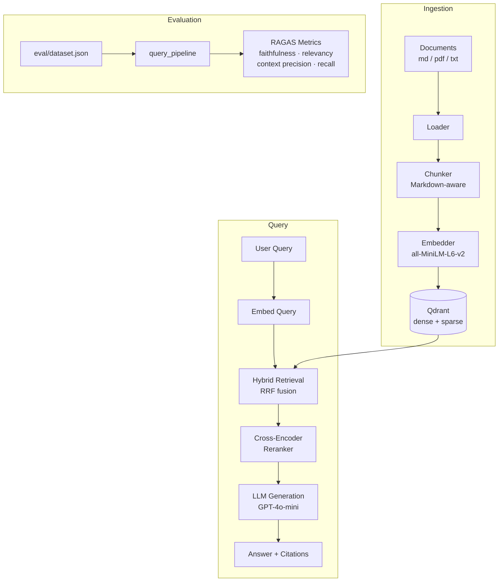

# docquery

A production-grade RAG system that queries technical documentation and returns answers with inline citations and confidence scores, evaluated with RAGAS metrics.

## Problem

Technical teams accumulate large volumes of documentation — architecture docs, runbooks, API references — that are expensive to search manually. Generic keyword search misses semantic intent; LLMs hallucinate without grounding. docquery combines hybrid retrieval (dense + BM25) with cross-encoder reranking and citation-grounded generation to produce accurate, verifiable answers from your own documentation corpus.

## Architecture



## Quickstart

**Prerequisites:** Docker, an OpenAI API key.

```bash
# 1. Start app + Qdrant
cp .env.example .env
# Add your OPENAI_API_KEY to .env
docker compose up

# 2. Ingest sample docs
make ingest docs/sample/

# 3. Query
curl -X POST http://localhost:8000/query \
  -H "Content-Type: application/json" \
  -d '{"query": "How does hybrid search work?"}'

# 4. Evaluate
make eval
```

**Local dev (no Docker):**

```bash
# Start Qdrant separately
docker run -p 6333:6333 qdrant/qdrant

# Install deps
uv sync --extra dev

# Serve
make serve
```

## Technical Decisions

| Decision | Options Considered | Choice | Rationale |
|---|---|---|---|
| Vector DB | ChromaDB, Qdrant, Pinecone | **Qdrant** | Built-in hybrid search + RRF fusion, no separate BM25 infra |
| Embeddings | OpenAI, Cohere, sentence-transformers | **all-MiniLM-L6-v2** | Zero cost, offline, swappable via config |
| Sparse vectors | fastembed/BM25, SPLADE, manual TF | **Manual TF + Modifier.IDF** | No extra deps; Qdrant handles IDF at query time |
| Chunking | Fixed-size, semantic, page-based | **MarkdownHeaderTextSplitter + RecursiveCharacterTextSplitter** | Splits by H1/H2/H3 first so every chunk carries a full breadcrumb section (e.g. `Deploy > Passo 3`); size splitter handles overflow within each section. PDF/txt with procedural patterns (`Passo N:`, `Step N:`) are promoted to markdown before chunking. |
| Reranking | None, LLM-based, cross-encoder | **cross-encoder/ms-marco-MiniLM-L-6-v2** | ~50ms latency, measurable quality gain, no LLM cost |
| Framework | LangChain, LlamaIndex, custom | **Thin custom + individual libs** | No framework lock-in, explicit pipeline control |
| Evaluation | Manual, RAGAS, custom | **RAGAS 0.4.x** | Industry standard, reproducible, comparable metrics |
| Config | dotenv, Dynaconf, pydantic-settings | **pydantic-settings** | Type-safe, env-based, integrates with FastAPI DI |

## Evaluation Results

Run `make eval` after ingesting docs to populate results. Results are saved to `eval/results/` as timestamped JSON.

| Metric | Description | Baseline |
|---|---|---|
| Faithfulness | Answer grounded in retrieved context | — |
| Answer Relevancy | Answer addresses the question | — |
| Context Precision | Retrieved contexts ranked by relevance | — |
| Context Recall | All relevant information retrieved | — |

*Run `make eval` to generate baseline scores.*

## API Reference

### `GET /health`
```bash
curl http://localhost:8000/health
# {"status":"ok"}
```

### `POST /query`
```bash
curl -X POST http://localhost:8000/query \
  -H "Content-Type: application/json" \
  -d '{"query": "What chunking strategy is used?"}'
```
```json
{
  "answer": "Markdown files are split using MarkdownHeaderTextSplitter [1], while other files use RecursiveCharacterTextSplitter as a fixed-size fallback [2].",
  "sources": [
    {"index": 1, "source": "docs/sample/ingestion.md", "chunk_index": 2, "score": 9.4, "text": "...", "section": "Ingestion Pipeline > Chunking"},
    {"index": 2, "source": "docs/sample/architecture.md", "chunk_index": 1, "score": 8.1, "text": "...", "section": ""}
  ],
  "query": "What chunking strategy is used?",
  "model": "gpt-4o-mini"
}
```

### `POST /ingest`
Returns `202 Accepted` immediately. Ingestion runs in the background.
```bash
curl -X POST http://localhost:8000/ingest \
  -H "Content-Type: application/json" \
  -d '{"path": "docs/sample"}'
# {"task_id": "e3b0c442-...", "status": "pending"}
```

### `GET /ingest/{task_id}`
Poll for ingestion status (`pending` → `running` → `done` / `error`).
```bash
curl http://localhost:8000/ingest/e3b0c442-...
# {"task_id": "e3b0c442-...", "status": "done", "chunks": 48, "deleted": 0, "error": null}
```

Interactive docs: `http://localhost:8000/docs`

## Project Structure

```
docquery/
├── src/docquery/
│   ├── config.py            # pydantic-settings env config
│   ├── ingest/
│   │   ├── loader.py        # document loaders (md, pdf, txt)
│   │   ├── chunker.py       # chunking strategies
│   │   ├── sparse.py        # BM25 sparse vector computation
│   │   └── pipeline.py      # ingestion orchestrator + CLI
│   ├── retrieve/
│   │   ├── embedder.py      # sentence-transformers wrapper
│   │   ├── hybrid.py        # hybrid retrieval with RRF
│   │   └── reranker.py      # cross-encoder reranking
│   ├── generate/
│   │   └── rag.py           # context assembly + LLM + citations
│   └── api/
│       ├── app.py           # FastAPI app
│       ├── routes.py        # /health, /query, /ingest
│       └── schemas.py       # request/response models
├── eval/
│   ├── dataset.json         # 20 question-answer pairs
│   ├── run_eval.py          # RAGAS evaluation runner
│   └── results/             # timestamped JSON results
├── docs/sample/             # sample docs for demo
├── tests/                   # pytest tests
├── docker-compose.yml       # app + Qdrant
├── Dockerfile
├── Makefile
└── pyproject.toml
```

## Collection Management

Qdrant exposes a full REST API and dashboard for managing the vector index — no extra endpoints needed in the application.

| Action | Command |
|--------|---------|
| Open dashboard | `http://localhost:6333/dashboard` |
| Inspect collection | `GET http://localhost:6333/collections/documents` |
| Reset index | `DELETE http://localhost:6333/collections/documents` |

Directory ingest is fully idempotent and self-healing:
- **No duplicates** — chunk IDs are SHA256(content + source), so re-ingesting the same file updates in place.
- **Orphan cleanup** — if a file is deleted from the directory, its chunks are automatically removed from Qdrant on the next ingest. The `deleted` field in the response reports how many sources were cleaned up.

## Production Considerations

Not implemented (out of scope for this project):

- **Auth** — add API key middleware or OAuth2 before exposing publicly
- **Streaming** — responses could be streamed; OpenAI SDK supports it
- **Chat history** — this is a single-turn Q&A system, not a chatbot
