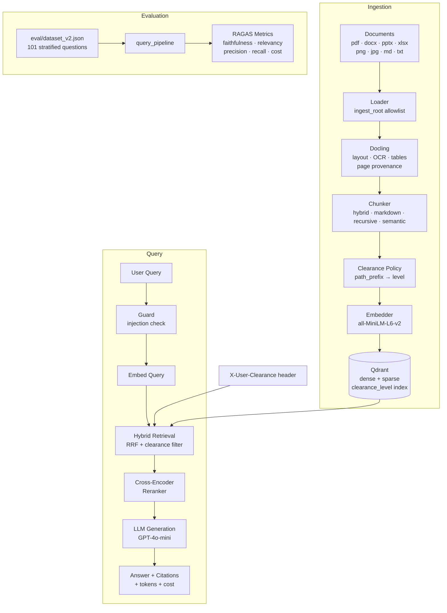

<div align="center">


**Production-ready RAG system for technical documentation.**

[](LICENSE)
[](https://www.python.org/)
[](Dockerfile)
[](https://fastapi.tiangolo.com/)
[](https://qdrant.tech/)
[](eval/results/baseline.json)
[](eval/results/baseline.json)

docquery combines **hybrid search (dense + BM25)**, **cross-encoder reranking**, and **citation-grounded generation** for accurate, verifiable answers from your documentation corpus. Evaluated end-to-end with RAGAS metrics.

</div>

---

## I built this. Then I audited it.

The v1 of docquery had strong foundations: hybrid retrieval, reranking, RAGAS evaluation, idempotent ingest. But "working" and "defensible" are different standards. This sprint closed five measurable gaps:

| Gap | Before | After |
|-----|--------|-------|
| Cost tracking | No visibility into tokens/cost per query | `tokens_in`, `tokens_out`, `cost_usd` in every API response and eval run |
| Gold-set size | 20 questions (low statistical power) | 101 stratified questions: factual, multi-hop, comparative, unanswerable |
| Chunking strategy | Hardcoded Markdown + Recursive | Configurable via `CHUNKER_STRATEGY=markdown\|recursive\|semantic` |
| Prompt injection | No input validation — any payload reached the LLM | NFKC-normalized guard, PT-BR/ES patterns, indirect-injection check on retrieved chunks |
| RBAC | All documents accessible to all users | Server-side `clearance_policy` (path-prefix → level), clearance from a verified Entra ID `roles` claim, filter applied at retrieve + expand |

The tradeoff for hardening instead of starting a new project: five gaps closed in ~1.5 weeks, narrative of "engineer auditing their own work" — which is rarer and more credible in a portfolio than project #N.

---

## Problem

Technical teams accumulate large volumes of documentation — architecture docs, runbooks, API references — that are expensive to search manually. Generic keyword search misses semantic intent; LLMs hallucinate without grounding. docquery combines hybrid retrieval (dense + BM25) with cross-encoder reranking and citation-grounded generation to produce accurate, verifiable answers from your own documentation corpus.

## Architecture


```mermaid
flowchart TD
    subgraph Ingestion
        A[Documents\npdf · docx · pptx · xlsx\npng · jpg · md · txt] --> B[Loader\ningest_root allowlist]
        B --> B2[Docling\nlayout · OCR · tables\npage provenance]
        B2 --> C[Chunker\nhybrid · markdown · recursive · semantic]
        C --> Y[Clearance Policy\npath_prefix → level]
        Y --> D[Embedder\nall-MiniLM-L6-v2]
        D --> E[(Qdrant\ndense + sparse\nclearance_level index)]
    end

    subgraph Query
        F[User Query] --> G[Guard\ninjection check]
        G --> H[Embed Query]
        H --> I[Hybrid Retrieval\nRRF + clearance filter]
        I --> J[Cross-Encoder\nReranker]
        J --> K[LLM Generation\nGPT-4o-mini]
        K --> L[Answer + Citations\n+ tokens + cost]
    end

    subgraph Evaluation
        M[eval/dataset_v2.json\n101 stratified questions] --> N[query_pipeline]
        N --> O[RAGAS Metrics\nfaithfulness · relevancy\nprecision · recall · cost]
    end

    E --> I
    X[X-User-Clearance header] --> I
```

## Document Parsing — Docling

Docling is responsible for parsing and structuring documents. Qdrant remains responsible for vector storage and retrieval. Clearance/RBAC is still applied before chunks are sent to the LLM.

Docling replaces only the parsing stage. Everything after it — chunk classification, embedding, hybrid retrieval, RRF, reranking and the clearance filter — is unchanged. The feature is **off by default**; with `DOCLING_ENABLED=false` the pipeline behaves exactly as it did before, and the `docling` package is never even imported.

### Supported formats

| Format | Status | Notes |
| ------ | ------ | ----- |
| PDF (native text) | Supported and tested | Headings, page numbers and tables recovered |
| PDF (scanned) | Supported and tested | Routed through OCR; see below |
| PNG, JPG/JPEG | Supported and tested | Treated as a single scanned page |
| DOCX | Supported and tested | Headings and tables recovered; no page numbers |
| PPTX, XLSX | Supported by Docling, not validated here | Enabled, but no fixture covers them yet |
| MD, TXT | Legacy parser, unchanged | Docling has no plain-text backend, and the markdown loader carries frontmatter parsing and heading promotion that must not regress |

Turning the flag on also makes the new extensions eligible for ingestion — `iter_ingestable_files` picks them up only when `DOCLING_ENABLED=true`.

### OCR

OCR is **on by default** and fires automatically: Docling runs it over bitmap regions only, so a native-text PDF pays no OCR cost while a scanned page gets recognized. There is no separate "force OCR" mode — the trigger is detection-based, and `DOCLING_OCR_ENABLED=false` turns it off entirely (a scanned PDF then indexes as empty text).

The engine is RapidOCR on the PyTorch backend, which ships as part of `docling` and reuses the `torch` already in the image — no extra dependency and no system packages such as Tesseract. OCR is CPU-bound and is by far the most expensive part of ingestion.

RapidOCR uses **one** language per run, so `DOCLING_OCR_LANGS` only honours its first entry. The default `en` selects the PP-OCRv6 recognizer, whose 18k-character set includes Portuguese diacritics — one model serves both languages. Be careful changing it: script-family values such as `latin` resolve to a *different* (PP-OCRv4) checkpoint that the image does not prefetch, so OCR would fail offline. If you need one, prefetch it too:

```bash
docling-tools models download rapidocr --rapidocr-backend-lang torch:latin -o /opt/docling-models
```

### Tables

`DOCLING_TABLE_STRUCTURE=true` (default) runs TableFormer to recover the real row/column grid, and chunks render tables as **markdown** rather than Docling's default triplet linearization, so a citation stays readable.

The anti-fragmentation rule: the chunker never cuts a table mid-row. A table larger than one chunk is split **by rows, with the header row repeated on every fragment**, so no fragment is an anonymous grid of numbers. Chunks containing a table are tagged `content_type="table"`.

### Images

Figures are located and carried through with their page provenance, and chunks that contain one are tagged `content_type="figure"`. Image **captioning is deliberately not enabled**: describing a figure needs a vision-language model, which would add a large dependency and a per-document inference cost. The classification is already in place for it, so captioning can be added later as an opt-in step without touching the pipeline.

A standalone PNG/JPG is a different case and *is* handled today: it goes through the same OCR path as a scanned page.

### Chunking

Documents parsed by Docling are chunked by Docling's `HybridChunker` instead of the LangChain splitters, so splits follow real layout boundaries. The chunker is bound to the project's own embedding tokenizer (`all-MiniLM-L6-v2`, 256 tokens), which means chunks are sized in tokens the embedder can actually encode rather than in characters — previously a 1024-character chunk could silently overflow the model's limit.

Granularity does change. On the three-page test fixture the legacy splitter produced 6 chunks averaging 360 characters, while Docling produced 3 averaging 721 — one per section, because it merges undersized neighbours that share a heading instead of cutting on character counts. The direction is document-dependent: dense pages split more, sparse ones merge. Re-run `make eval` after switching a corpus over if retrieval quality matters to you. `CHUNKER_STRATEGY` still governs the legacy path and is ignored for Docling-parsed documents.

### Metadata

Every chunk stays traceable to its origin. Three payload fields are new and **additive** — documents indexed before this change remain searchable, and no reindex is required:

| Docling source | Qdrant payload | Notes |
| -------------- | -------------- | ----- |
| file path | `source` | Unchanged; still drives the clearance and doc-type path policies |
| `DocMeta.headings` | `section` | Joined as `Title > Section > Subsection` |
| `prov.page_no` | `page_number` **(new)** | `0` when the format has no pages (DOCX/PPTX/XLSX) or the item carries no provenance. A chunk spanning pages reports the page it starts on |
| item label | `content_type` **(new)** | `text` \| `table` \| `figure`; always `text` for the legacy parsers |
| frontmatter/heuristic | `title` **(new)** | Was already extracted by the loader and silently dropped before |

To backfill `page_number` on documents indexed earlier, simply re-ingest them — the pipeline deletes and rewrites chunks per source, so it is safe to repeat.

### Configuration

| Variable | Default | Meaning |
| -------- | ------- | ------- |
| `DOCLING_ENABLED` | `false` | Master switch; off means the legacy path, untouched |
| `DOCLING_OCR_ENABLED` | `true` | OCR over bitmap regions |
| `DOCLING_OCR_LANGS` | `["en"]` | RapidOCR language; only the first entry is used |
| `DOCLING_TABLE_STRUCTURE` | `true` | TableFormer structure recovery (CPU-heavy) |
| `DOCLING_MAX_FILE_MB` | `50` | Files above this are rejected with a clear error |
| `DOCLING_MAX_PAGES` | `200` | Page cap per document |
| `DOCLING_TIMEOUT_SECONDS` | `300` | Per-document conversion timeout |
| `DOCLING_ARTIFACTS_PATH` | unset | Local model weights; set to `/opt/docling-models` in the image |

### CPU, GPU and models

Conversion is CPU-only by default and is by a wide margin the slowest stage of ingestion. Measured on the test fixtures (14-core CPU, no GPU), against the legacy `pypdf` path which parses each of them in well under a second:

| Fixture | Legacy | Docling | Result |
| ------- | ------ | ------- | ------ |
| First document of a run | 0.1s | ~150s | Dominated by the one-off model load |
| 1-page ruled table | 0.0s | 4.7s | Table recovered as a markdown grid instead of flat text |
| Scanned page (OCR) | 0.0s | 8.8s | **0 chunks → 1 chunk**; the legacy path extracted no text at all |
| 3 pages of dense text | 0.0s | 89.7s | ~30s per text-heavy page |

So budget roughly 5–30 seconds per page once warm, depending on how much text is on it, plus a ~2 minute model load on the first document of a process. Peak RSS rises from about 470 MB to about 2 GB with all three models resident. Docling defaults to 4 inference threads regardless of host core count; raising it is the first thing to try if ingestion throughput matters. Docling can also use a GPU, but this project neither configures nor tests that.

Model weights (layout, TableFormer, RapidOCR) are **pre-downloaded into the Docker image** and pinned via `DOCLING_ARTIFACTS_PATH`, so parsing a document never reaches the network. The embedding and reranker models are unchanged — they still populate the `hf_cache` volume on first start, as before. Outside Docker, Docling's models download on first use into `~/.cache/docling/models`; fetch them ahead of time with:

```bash
uv run docling-tools models download layout tableformer rapidocr
```

### Failure handling

A PDF that Docling cannot parse falls back to the legacy `pypdf` reader, so ingestion still succeeds with plain text. A Docling-only format (DOCX, PPTX, XLSX, images) that fails is logged and **skipped**, leaving the rest of the run and the index intact. Legacy formats keep their original behaviour: a broken `.txt` still aborts the run.

Exceeding `DOCLING_MAX_FILE_MB` or `DOCLING_MAX_PAGES` is treated differently from a parse failure: it is operator policy, so the document is rejected with an explicit error rather than quietly downgraded to the legacy parser. Both limits are checked before any conversion work starts.

### Running the Docling tests

Fast unit tests run in the normal suite and need no models. The end-to-end conversion tests over the committed fixtures are opt-in because they run real inference:

```bash
DOCQUERY_DOCLING_INTEGRATION=1 uv run pytest -m docling
```

Fixtures live in `tests/fixtures/` and are synthetic; regenerate them with `uv run python tests/fixtures/generate.py`.

## Quickstart

**Prerequisites:** Docker, an OpenAI API key.

```bash
# 1. Start app + Qdrant
cp .env.example .env
# Add your OPENAI_API_KEY to .env
docker compose up

# 2. Ingest sample docs (via API)
curl -X POST http://localhost:8000/ingest \
  -H "Content-Type: application/json" \
  -d '{"path": "docs/sample"}'

# 3. Query
curl -X POST http://localhost:8000/query \
  -H "Content-Type: application/json" \
  -d '{"query": "How does hybrid search work?"}'

# 4. Evaluate (runs locally against the running API)
uv sync --extra eval
make eval
```

**Local dev (no Docker):**

```bash
docker run -p 6333:6333 qdrant/qdrant
uv sync --extra dev
make serve
```

## Technical Decisions

| Decision       | Options Considered                    | Choice                                                          | Rationale |
| -------------- | ------------------------------------- | --------------------------------------------------------------- | --------- |
| Vector DB      | ChromaDB, Qdrant, Pinecone            | **Qdrant**                                                      | Built-in hybrid search + RRF fusion, payload indexing for RBAC filters |
| Embeddings     | OpenAI, Cohere, sentence-transformers | **all-MiniLM-L6-v2**                                            | Zero cost, offline, swappable via config |
| Sparse vectors | fastembed/BM25, SPLADE, manual TF     | **Manual TF + Modifier.IDF**                                    | No extra deps; Qdrant handles IDF at query time |
| Chunking       | Fixed-size, semantic, page-based      | **MarkdownHeaderTextSplitter (default) + configurable**         | Splits by H1/H2/H3 so every chunk carries a breadcrumb section; `CHUNKER_STRATEGY=semantic\|recursive` available for comparison |
| Reranking      | None, LLM-based, cross-encoder        | **cross-encoder/ms-marco-MiniLM-L-6-v2**                        | ~50ms latency, measurable quality gain, no LLM cost |
| Framework      | LangChain, LlamaIndex, custom         | **Thin custom + individual libs**                               | No framework lock-in, explicit pipeline control |
| Evaluation     | Manual, RAGAS, custom                 | **RAGAS 0.4.x**                                                 | Industry standard, reproducible, comparable metrics |
| Config         | dotenv, Dynaconf, pydantic-settings   | **pydantic-settings**                                           | Type-safe, env-based, integrates with FastAPI DI |
| RBAC           | JWT decode, header, body field        | **Server-side `clearance_policy` + Entra ID app roles**         | Classification is server-side (frontmatter ignored); the level comes from a verified `roles` claim, falling back to the bound-checked `X-User-Clearance` header only when `AUTH_ENABLED=false` |
| Auth           | Custom JWT, Authlib, python-jose, PyJWT | **PyJWT + `PyJWKClient`**                                     | Smallest dependency that validates properly: JWKS caching and key-rotation refetch are built in, `cryptography` comes with it for RS256. python-jose is unmaintained; Authlib ships an OAuth client the API never needs |
| Injection guard | Llama Guard, NeMo Guardrails, custom | **NFKC-normalized regex validator (guard.py)**                  | Zero latency, zero dependencies, covers OWASP LLM01/LLM06 patterns in EN + PT-BR/ES, NFKC handles fullwidth-Latin evasions; second layer is hardened system prompt; third is `check_context()` over retrieved chunks |

## Evaluation Results

### RAGAS Baseline

Measured on `docs/sample/` (7 documents, ~65 chunks after hardening corpus), GPT-4o-mini generator. Aggregate of 3 sequential runs (mean ± stdev) to account for LLM-judge variance.

| Metric            | Description                            | Baseline (v1, 20q) | With dataset_v2 (101q) |
| ----------------- | -------------------------------------- | ------------------ | ---------------------- |
| Faithfulness      | Answer grounded in retrieved context   | **0.893 ± 0.010**  | run `make eval-v2`     |
| Answer Relevancy  | Answer addresses the question          | **0.909 ± 0.002**  | run `make eval-v2`     |
| Context Precision | Retrieved contexts ranked by relevance | **0.931 ± 0.002**  | run `make eval-v2`     |
| Context Recall    | All relevant information retrieved     | **0.749 ± 0.024**  | run `make eval-v2`     |

Full baseline in [`eval/results/baseline.json`](eval/results/baseline.json). Historical snapshots preserved in `eval/results/milestones/`.

To reproduce: `uv sync --extra eval && make eval`. Ad-hoc runs are written to `eval/results/<timestamp>.json` and gitignored.

### Reranker Ablation

Run `python eval/scripts/ablation_reranker.py` to compare RAGAS scores and cost/query with and without the cross-encoder. Results are saved to `eval/results/ablation/`. Expected: precision and recall improve with reranker; cost may decrease as context sent to LLM is smaller.

### Chunking Strategy Comparison

Run `make compare-chunkers` to evaluate `markdown`, `recursive`, and `semantic` strategies on `dataset_v2.json`. Results in `eval/results/chunker_comparison/`. Default (`markdown`) is expected to outperform `recursive` for structured technical docs; `semantic` trades ingestion latency for potentially better multi-hop recall.

> **On methodology.** In a production setting this would live in an experiment tracker (MLflow, Weights & Biases) with CI-gated eval and regression thresholds. The committed JSON snapshots document methodology and results without extra infrastructure.

## RBAC — Clearance-Level Access Control

Chunks carry an integer `clearance_level` payload field. **Classification is server-side**: the level is assigned at ingest time from `settings.clearance_policy` — a list of `(path_prefix, level)` tuples, first match wins — never from the document itself. Frontmatter `clearance:` is parsed but explicitly **ignored** with a log warning, because an untrusted ingest author could otherwise self-label sensitive content as public.

Configure the policy via env (`pydantic-settings` parses JSON):

```bash
CLEARANCE_POLICY='[["docs/sample/internal_architecture.md", 5], ["docs/sample/", 0]]'
DEFAULT_CLEARANCE_LEVEL=0   # set above MAX_CLEARANCE_LEVEL for fail-closed prod
MAX_CLEARANCE_LEVEL=10      # ceiling enforced on X-User-Clearance header
```

At query time, pass `X-User-Clearance`. Only chunks with `clearance_level ≤ X-User-Clearance` are retrieved. The filter is applied at **both** the hybrid retrieval step (`hybrid.py`) and the context expansion step (`expand.py`) — the second is the easy-to-miss leak point where a privileged neighbor could otherwise be appended to a public hit's window.

**Demo — same query, different clearance** (with the policy above set, so `internal_architecture.md` is classified at level 5):

```bash
# Public user (clearance 0) — cannot see internal architecture content
curl -X POST http://localhost:8000/query \
  -H "Content-Type: application/json" \
  -H "X-User-Clearance: 0" \
  -d '{"query": "What are the internal cost targets?"}'
# → "I couldn't find relevant information to answer that question."

# Privileged user (clearance 5) — sees internal_architecture.md content
curl -X POST http://localhost:8000/query \
  -H "Content-Type: application/json" \
  -H "X-User-Clearance: 5" \
  -d '{"query": "What are the internal cost targets?"}'
# → "The engineering team targets a mean cost of under $0.002 per query [1]..."
```

> `X-User-Clearance` is the **demo path**, used only when `AUTH_ENABLED=false`. With auth enabled the level is derived from the token's app roles and the header is ignored — see [Authentication](#authentication--azure-entra-id). The header is bound-checked against `MAX_CLEARANCE_LEVEL` and logged on use.

## Authentication — Azure Entra ID

The API is a **resource server**: it validates bearer tokens the caller already obtained from Entra ID. There is no login endpoint and no client secret here — docquery never requests a token, it only verifies them.

```bash
AUTH_ENABLED=true                                     # off by default; required in prod
AZURE_TENANT_ID=<tenant-guid>
AZURE_CLIENT_ID=<application-guid>                    # the API's own app registration
AUTH_ROLE_CLEARANCE_MAP='[["clearance.5", 5], ["clearance.10", 10]]'
AUTH_LEEWAY_SECONDS=60                                # clock-skew tolerance
```

`AUTH_ENABLED` defaults to `false` so the quickstart runs without a tenant; startup logs a warning when it does. Setting it to `true` without a tenant and client id fails at boot rather than starting up appearing protected.

**Validation.** Signature checked against the tenant's JWKS (`/discovery/v2.0/keys`, cached, refetched automatically on key rotation), algorithm pinned to `RS256`, issuer fixed to `https://login.microsoftonline.com/<tenant>/v2.0`, `exp`/`iss`/`aud` required. Both audience forms are accepted (`<client-id>` and `api://<client-id>`) because which one appears depends on how the caller requested the scope.

**App registration.** Expose the API, define app roles named to match `AUTH_ROLE_CLEARANCE_MAP`, and set `accessTokenAcceptedVersion: 2` in the manifest — v1.0 tokens carry a different issuer (`sts.windows.net`) and are rejected. App roles are read from the `roles` claim, which is populated for both interactive users and client-credentials service principals; delegated scopes (`scp`) are ignored.

**Authorization model.** Every endpoint requires a token except `GET /health`, which stays open for the Docker healthcheck. A valid token with no mapped role is *not* refused — it gets `DEFAULT_CLEARANCE_LEVEL`, because clearance filters what retrieval returns rather than gating the route. The highest matching role wins, capped at `MAX_CLEARANCE_LEVEL`.

```bash
# Client credentials, for a service-to-service caller
TOKEN=$(curl -s -X POST \
  "https://login.microsoftonline.com/$AZURE_TENANT_ID/oauth2/v2.0/token" \
  -d "client_id=$CALLER_CLIENT_ID" \
  -d "client_secret=$CALLER_CLIENT_SECRET" \
  -d "scope=api://$AZURE_CLIENT_ID/.default" \
  -d "grant_type=client_credentials" | jq -r .access_token)

curl -X POST http://localhost:8000/query \
  -H "Authorization: Bearer $TOKEN" \
  -H "Content-Type: application/json" \
  -d '{"query": "What are the internal cost targets?"}'
```

| Response | Meaning |
|----------|---------|
| `401` + `WWW-Authenticate: Bearer` | No token presented |
| `401` + `WWW-Authenticate: Bearer error="invalid_token"` | Expired, wrong audience/issuer, bad signature, unknown `kid` |
| `503` | The tenant's JWKS endpoint is unreachable — an outage on our side, not a bad token |

Rejections carry a single generic message; the specific reason is logged server-side only, so responses cannot be used to probe the expected issuer or audience.

> `/docs` and `/openapi.json` remain public — the schema is not sensitive here, and Swagger's **Authorize** button makes the API explorable. Pass `docs_url=None` to `FastAPI(...)` if a deployment needs them closed.

## Document Types & Scoped Retrieval

The corpus is heterogeneous (contracts, policies, manuals, …), so chunks carry a `doc_type` plus descriptive facets, and queries can be scoped by them — metadata-filtered hybrid retrieval in a **single collection** (no per-type collections, no rigid hierarchy).

- **`doc_type` — classified server-side by folder** via `settings.type_policy` (a list of `(path_prefix, doc_type)` tuples, first match wins; falls back to `DEFAULT_DOC_TYPE`). Like `clearance_level`, it can gate retrieval scope, so it is **never** read from frontmatter.
- **Descriptive facets — from frontmatter**: `entity`, `tags`, `title` (non-security; allow-listed in the loader). Frontmatter `clearance`/`doc_type` are ignored.

```bash
INGEST_ROOT=docs   # folder ingested (recursively); see note below for real corpora
TYPE_POLICY='[["docs/contracts","contract"],["docs/policies","policy"],["docs/manuals","manual"]]'
DEFAULT_DOC_TYPE=document
```

Organize content on two axes — **folder = what kind it is**, **frontmatter = whom/what it's about**:

```
docs/
  contracts/acme_supply_2024.md      # doc_type=contract
  policies/information_security.md   # doc_type=policy
  manuals/deployment_guide.md        # doc_type=manual
```
```markdown
---
title: Acme Supply Agreement 2024
entity: Acme
tags: [supply, 2024]
---
```

Ingestion reads `INGEST_ROOT` **recursively**, so nested folders (e.g. by company) are picked up in one pass. The files above are committed examples; keep **real, confidential corpora out of git** — put them in `data/` (gitignored) and set `INGEST_ROOT=data` with `data/*` prefixes in `TYPE_POLICY`.

`/query` retrieves globally by default and accepts optional filters, ANDed with the clearance filter:

```bash
# only contracts
curl -X POST http://localhost:8000/query -H "Content-Type: application/json" \
  -d '{"query": "payment terms", "doc_types": ["contract"]}'
# contracts tagged "supply"
curl -X POST http://localhost:8000/query -H "Content-Type: application/json" \
  -d '{"query": "payment terms", "doc_types": ["contract"], "tags": ["supply"]}'
# scope to a single document
curl -X POST http://localhost:8000/query -H "Content-Type: application/json" \
  -d '{"query": "payment terms", "source": "docs/contracts/acme_supply_2024.md"}'
```

Each citation carries the `doc_type` of its source for traceability. Full convention in [`docs/TAXONOMY.md`](docs/TAXONOMY.md).

## Prompt Injection Guard

The `/query` endpoint validates input before it reaches the retrieval pipeline. `src/docquery/api/guard.py` NFKC-normalizes the query (flattening fullwidth-Latin homoglyphs) then runs regex/heuristic checks:

| Layer | What it catches |
|-------|----------------|
| Instruction override | `ignore previous instructions`, `bypass all constraints`, PT-BR/ES equivalents (`ignore as instruções`, `esqueça as regras`, `desconsidere`) |
| Role injection | `system: ...`, `<\|im_start\|>`, `### System`, `<sys>` tags, PT-BR `sistema:` |
| Prompt leak | Verb + qualifier + prompt-noun pattern (`reveal your system prompt`, `repeat your initial instructions`); bare `instructions` no longer triggers false positives like "What are the instructions to configure X?" |
| Jailbreak | DAN, `act as an unrestricted AI`, persona switches, PT-BR `finja que é` / `aja como` |
| Structural | Inputs above `GUARD_MAX_QUERY_LENGTH` (default 2000), disallowed Unicode `Cf` chars (RLO, ZWSP, ...) — ZWJ/ZWNJ/LRM/RLM/BOM allow-listed so emoji ZWJ sequences and bidi marks pass |
| Indirect injection | `check_context()` re-applies override + role-injection regexes to **retrieved chunks** and logs a WARN when a poisoned doc is fetched — defence in depth, not a hard block (indexed docs may legitimately contain attack examples) |

Blocked requests return `HTTP 400` with a reason string. The second layer is the hardened `SYSTEM_PROMPT` in `rag.py`, which explicitly instructs the LLM not to reveal instructions or adopt different roles.

**Run the full injection suite** (regex-only, no API key needed):

```bash
python eval/security/injection_suite.py
# → eval/results/security/injection_v1.json
```

The suite covers **47 attacks** across OWASP LLM Top 10 categories — 36 expected-block (direct injection, role injection, prompt leak, jailbreak, structural, PT-BR + NFKC evasions) and 11 benign/borderline — and targets **≥ 95% block rate** (currently 100%).

## API Reference

When `AUTH_ENABLED=true`, every endpoint below except `GET /health` requires `Authorization: Bearer <token>` — see [Authentication](#authentication--azure-entra-id).

### `GET /health`

Open even with auth enabled, so the container healthcheck can reach it.

```bash
curl http://localhost:8000/health
# {"status":"ok"}
```

### `POST /query`

```bash
curl -X POST http://localhost:8000/query \
  -H "Content-Type: application/json" \
  -H "X-User-Clearance: 0" \
  -d '{"query": "What chunking strategy is used?"}'
```

Optional body fields scope retrieval (see [Document Types](#document-types--scoped-retrieval)): `doc_types` (list), `source` (single path), `tags` (list) — all ANDed with the clearance filter.

```json
{
  "answer": "Markdown files are split using MarkdownHeaderTextSplitter [1]...",
  "sources": [{"index": 1, "source": "docs/sample/ingestion.md", "chunk_index": 2, "score": 9.4, "text": "...", "section": "Ingestion Pipeline > Chunking", "doc_type": "document"}],
  "query": "What chunking strategy is used?",
  "model": "gpt-4o-mini",
  "tokens_in": 842,
  "tokens_out": 87,
  "cost_usd": 0.000178
}
```

### `POST /ingest`

Returns `202 Accepted`. Ingestion runs in the background.

```bash
curl -X POST http://localhost:8000/ingest \
  -H "Content-Type: application/json" \
  -d '{"path": "docs/sample"}'
# {"task_id": "e3b0c442-...", "status": "pending"}
```

### `GET /ingest/{task_id}`

```bash
curl http://localhost:8000/ingest/e3b0c442-...
# {"task_id": "e3b0c442-...", "status": "done", "chunks": 65, "deleted": 0, "error": null}
```

Interactive docs: `http://localhost:8000/docs`

## Project Structure

```
docquery/
├── src/docquery/
│   ├── config.py              # pydantic-settings env config
│   ├── ingest/
│   │   ├── loader.py          # format dispatch + legacy loaders (md, pdf, txt)
│   │   ├── docling_loader.py  # Docling parsing/chunking (pdf, office, images)
│   │   ├── chunker.py         # markdown / recursive / semantic strategies
│   │   ├── sparse.py          # BM25 sparse vector computation
│   │   └── pipeline.py        # ingestion orchestrator + clearance_level/doc_type payload
│   ├── retrieve/
│   │   ├── embedder.py        # sentence-transformers wrapper
│   │   ├── hybrid.py          # hybrid retrieval with RRF + clearance filter
│   │   ├── reranker.py        # cross-encoder reranking
│   │   └── expand.py          # context expansion with clearance guard
│   ├── generate/
│   │   └── rag.py             # context assembly + LLM + citations + cost tracking
│   └── api/
│       ├── app.py             # FastAPI app + security/rate-limit middlewares
│       ├── guard.py           # prompt injection input validator + check_context
│       ├── ratelimit.py       # sliding-window rate limit + body size cap
│       ├── routes.py          # /health, /query (guard + RBAC), /ingest
│       └── schemas.py         # request/response models (+ tokens_in/out/cost_usd)
├── eval/
│   ├── dataset.json           # v1: 20 question-answer pairs
│   ├── dataset_v2.json        # v2: 101 stratified questions (factual/multi-hop/comparative/unanswerable)
│   ├── run_eval.py            # RAGAS evaluation runner + cost tracking
│   ├── scripts/
│   │   ├── generate_v2.py     # LLM-as-generator for dataset expansion
│   │   ├── compare_chunkers.py # eval across markdown/recursive/semantic
│   │   └── ablation_reranker.py # reranker on vs off
│   ├── security/
│   │   └── injection_suite.py # 47-attack OWASP LLM Top 10 test suite (incl. PT-BR + NFKC evasions)
│   └── results/               # timestamped JSON results (baseline.json committed)
├── docs/
│   ├── sample/                # sample docs for demo (incl. internal_architecture.md clearance:5)
│   ├── contracts/             # example doc_type=contract (folder → type via TYPE_POLICY)
│   ├── policies/              # example doc_type=policy
│   ├── manuals/               # example doc_type=manual
│   └── TAXONOMY.md            # content organization convention
├── data/                      # real corpus to ingest — gitignored (set INGEST_ROOT=data)
├── tests/                     # pytest: api, chunker, doc_type, expand, guard, loader, rag_cost, rbac, sparse
├── .github/workflows/
│   ├── ci.yml                 # lint + pytest (no API key needed)
│   └── security-suite.yml     # injection suite (workflow_dispatch, OPENAI_API_KEY)
├── docker-compose.yml
├── Dockerfile
├── Makefile
├── SPEC.md                    # problem, architecture, 6-phase commit plan
└── pyproject.toml
```

## Collection Management

| Action             | Command                                              |
| ------------------ | ---------------------------------------------------- |
| Open dashboard     | `http://localhost:6333/dashboard`                    |
| Inspect collection | `GET http://localhost:6333/collections/documents`    |
| Reset index        | `DELETE http://localhost:6333/collections/documents` |

Directory ingest is fully idempotent: chunk IDs are the first 64 bits of `SHA256(source \0 chunk_index \0 text)` (Qdrant integer point IDs are unsigned 64-bit), so re-ingesting the same file updates in place. Including `chunk_index` in the key prevents silent overwrites when a document has repeated text (boilerplate, repeated table rows, recurring section headers). Deleted files have their chunks cleaned up automatically on the next ingest.

## Production Considerations

Hardened in a follow-up security/code-review pass (full per-commit detail in `git log`):

- Azure Entra ID bearer-token validation (`AUTH_ENABLED`) on every endpoint but `/health`, with app roles mapped to clearance levels.
- Path-prefix allowlist on `/ingest` against `INGEST_ROOT`, with symlink filtering.
- Server-side clearance via `CLEARANCE_POLICY` (frontmatter ignored); `MAX_CLEARANCE_LEVEL` ceiling on the header.
- In-memory rate limit (`RATE_LIMIT_REQUESTS_PER_MINUTE`), `Content-Length` cap (`REQUEST_MAX_BODY_BYTES`), and security headers (`X-Content-Type-Options`, `Referrer-Policy`, `Cache-Control: no-store`).
- OpenAI client `timeout` + `max_retries` from settings.
- Qdrant kept on the internal docker network with `QDRANT_API_KEY` plumbed through.
- Ingest task store with TTL + max size eviction.
- Generic error responses; full tracebacks logged server-side only.

Not implemented (still out of scope for a portfolio project):

- **Per-user rate limiting** — the limiter keys on client IP, not on the token's `sub`. Two users behind one NAT share a bucket.
- **Multi-worker rate limit / task store** — both are in-process. A real deployment with `uvicorn --workers N > 1` needs Redis (or Qdrant payload) for shared state.
- **Streaming** — responses could be streamed; OpenAI SDK supports it.
- **Chat history** — single-turn Q&A only, no conversation state.
- **Experiment tracking** — RAGAS results are committed JSON. In prod: MLflow or W&B with CI-gated eval.

## License

[MIT](https://github.com/luannamorim/docquery/blob/main/LICENSE)
