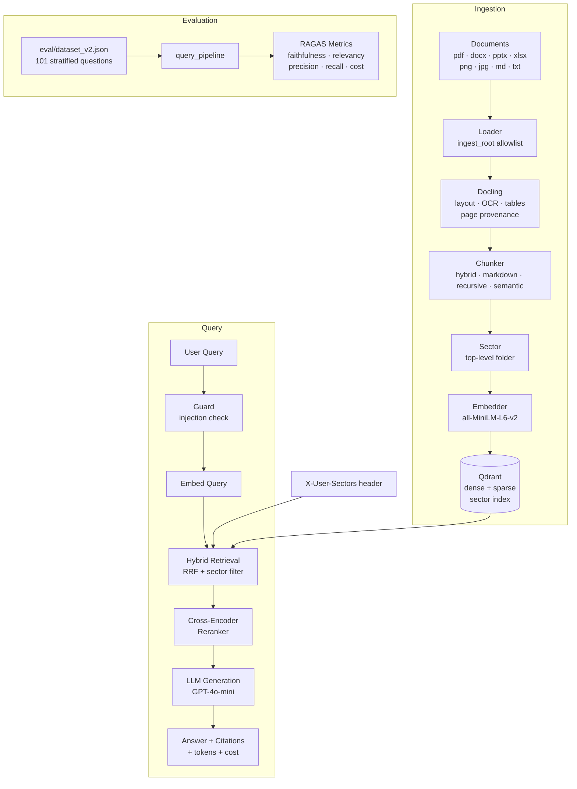

<div align="center">


**Production-ready RAG system for technical documentation.**

[](LICENSE)
[](https://www.python.org/)
[](Dockerfile)
[](https://fastapi.tiangolo.com/)
[](https://qdrant.tech/)
[](eval/results/baseline.json)
[](eval/results/baseline.json)

docquery combines **hybrid search (dense + BM25)**, **cross-encoder reranking**, and **citation-grounded generation** for accurate, verifiable answers from your documentation corpus. Evaluated end-to-end with RAGAS metrics.

</div>

---

## I built this. Then I audited it.

The v1 of docquery had strong foundations: hybrid retrieval, reranking, RAGAS evaluation, idempotent ingest. But "working" and "defensible" are different standards. This sprint closed five measurable gaps:

| Gap | Before | After |
|-----|--------|-------|
| Cost tracking | No visibility into tokens/cost per query | `tokens_in`, `tokens_out`, `cost_usd` in every API response and eval run |
| Gold-set size | 20 questions (low statistical power) | 101 stratified questions: factual, multi-hop, comparative, unanswerable |
| Chunking strategy | Hardcoded Markdown + Recursive | Configurable via `CHUNKER_STRATEGY=markdown\|recursive\|semantic` |
| Prompt injection | No input validation — any payload reached the LLM | NFKC-normalized guard, PT-BR/ES patterns, indirect-injection check on retrieved chunks |
| RBAC | All documents accessible to all users | Sector compartments derived from the ingested tree, granted by a verified Entra ID `roles` claim, filter applied at retrieve + expand |

The tradeoff for hardening instead of starting a new project: five gaps closed in ~1.5 weeks, narrative of "engineer auditing their own work" — which is rarer and more credible in a portfolio than project #N.

---

## Problem

Technical teams accumulate large volumes of documentation — architecture docs, runbooks, API references — that are expensive to search manually. Generic keyword search misses semantic intent; LLMs hallucinate without grounding. docquery combines hybrid retrieval (dense + BM25) with cross-encoder reranking and citation-grounded generation to produce accurate, verifiable answers from your own documentation corpus.

## Architecture


```mermaid
flowchart TD
    subgraph Ingestion
        A[Documents\npdf · docx · pptx · xlsx\npng · jpg · md · txt] --> B[Loader\ningest_root allowlist]
        B --> B2[Docling\nlayout · OCR · tables\npage provenance]
        B2 --> C[Chunker\nhybrid · markdown · recursive · semantic]
        C --> Y[Sector\ntop-level folder]
        Y --> D[Embedder\nall-MiniLM-L6-v2]
        D --> E[(Qdrant\ndense + sparse\nsector index)]
    end

    subgraph Query
        F[User Query] --> G[Guard\ninjection check]
        G --> H[Embed Query]
        H --> I[Hybrid Retrieval\nRRF + sector filter]
        I --> J[Cross-Encoder\nReranker]
        J --> K[LLM Generation\nGPT-4o-mini]
        K --> L[Answer + Citations\n+ tokens + cost]
    end

    subgraph Evaluation
        M[eval/dataset_v2.json\n101 stratified questions] --> N[query_pipeline]
        N --> O[RAGAS Metrics\nfaithfulness · relevancy\nprecision · recall · cost]
    end

    E --> I
    X[X-User-Sectors header] --> I
```

## Document Parsing — Docling

Docling is responsible for parsing and structuring documents. Qdrant remains responsible for vector storage and retrieval. The sector filter is still applied before chunks are sent to the LLM.

Docling replaces only the parsing stage. Everything after it — chunk classification, embedding, hybrid retrieval, RRF, reranking and the sector filter — is unchanged. The feature is **off by default**; with `DOCLING_ENABLED=false` the pipeline behaves exactly as it did before, and the `docling` package is never even imported.

### Supported formats

| Format | Status | Notes |
| ------ | ------ | ----- |
| PDF (native text) | Supported and tested | Headings, page numbers and tables recovered |
| PDF (scanned) | Supported and tested | Routed through OCR; see below |
| PNG, JPG/JPEG | Supported and tested | Treated as a single scanned page |
| DOCX | Supported and tested | Headings and tables recovered; no page numbers |
| PPTX, XLSX | Supported by Docling, not validated here | Enabled, but no fixture covers them yet |
| MD, TXT | Legacy parser, unchanged | Docling has no plain-text backend, and the markdown loader carries frontmatter parsing and heading promotion that must not regress |

Turning the flag on also makes the new extensions eligible for ingestion — `iter_ingestable_files` picks them up only when `DOCLING_ENABLED=true`.

### OCR

OCR is **on by default** and fires automatically: Docling runs it over bitmap regions only, so a native-text PDF pays no OCR cost while a scanned page gets recognized. There is no separate "force OCR" mode — the trigger is detection-based, and `DOCLING_OCR_ENABLED=false` turns it off entirely (a scanned PDF then indexes as empty text).

The engine is RapidOCR on the PyTorch backend, which ships as part of `docling` and reuses the `torch` already in the image — no extra dependency and no system packages such as Tesseract. OCR is CPU-bound and is by far the most expensive part of ingestion.

RapidOCR uses **one** language per run, so `DOCLING_OCR_LANGS` only honours its first entry. The default `en` selects the PP-OCRv6 recognizer, whose 18k-character set includes Portuguese diacritics — one model serves both languages. Be careful changing it: script-family values such as `latin` resolve to a *different* (PP-OCRv4) checkpoint that the image does not prefetch, so OCR would fail offline. If you need one, prefetch it too:

```bash
docling-tools models download rapidocr --rapidocr-backend-lang torch:latin -o /opt/docling-models
```

**Validating OCR for a screenshot-heavy corpus.** A manual exported from Word can hold most of its content inside embedded screenshots: the reference manual has 21 pages, ~7.100 chars of native text and 48 images. With `DOCLING_ENABLED=false` such a document indexes silently *half* — the "no text extracted" warning never fires because the document is not empty, only incomplete. Before trusting OCR on a new corpus:

1. `make measure-ocr PDF=<reference manual>` — converts the PDF twice through the production Docling configuration, varying only `do_ocr`, and prints per-page char deltas plus sample accented lines that exist **only** with OCR. Inspect those samples: PP-OCRv6 covering PT diacritics is a claim, and this is where it gets checked. If accent coverage is poor, weigh swapping the prefetched checkpoint (see above) — a separate decision. Results land in `eval/results/ocr_coverage/summary.json`.
2. Set `DOCLING_ENABLED=true` in that corpus's environment (the project default stays off) and re-ingest.
3. Acceptance: `POST /query` for strings that exist only inside screenshots (e.g. a field label or a button caption from a print) must return the manual as a citation.

### Tables

`DOCLING_TABLE_STRUCTURE=true` (default) runs TableFormer to recover the real row/column grid, and chunks render tables as **markdown** rather than Docling's default triplet linearization, so a citation stays readable.

The anti-fragmentation rule: the chunker never cuts a table mid-row. A table larger than one chunk is split **by rows, with the header row repeated on every fragment**, so no fragment is an anonymous grid of numbers. Chunks containing a table are tagged `content_type="table"`.

### Images

Figures are located and carried through with their page provenance, and chunks that contain one are tagged `content_type="figure"`. Image **captioning is deliberately not enabled**: describing a figure needs a vision-language model, which would add a large dependency and a per-document inference cost. The classification is already in place for it, so captioning can be added later as an opt-in step without touching the pipeline.

A standalone PNG/JPG is a different case and *is* handled today: it goes through the same OCR path as a scanned page.

### Chunking

Documents parsed by Docling are chunked by Docling's `HybridChunker` instead of the LangChain splitters, so splits follow real layout boundaries. The chunker is bound to the project's own embedding tokenizer (`all-MiniLM-L6-v2`, 256 tokens), which means chunks are sized in tokens the embedder can actually encode rather than in characters — previously a 1024-character chunk could silently overflow the model's limit.

Granularity does change. On the three-page test fixture the legacy splitter produced 6 chunks averaging 360 characters, while Docling produced 3 averaging 721 — one per section, because it merges undersized neighbours that share a heading instead of cutting on character counts. The direction is document-dependent: dense pages split more, sparse ones merge. Re-run `make eval` after switching a corpus over if retrieval quality matters to you. `CHUNKER_STRATEGY` still governs the legacy path and is ignored for Docling-parsed documents.

### Metadata

Every chunk stays traceable to its origin. Three payload fields are new and **additive** — documents indexed before this change remain searchable, and no reindex is required:

| Docling source | Qdrant payload | Notes |
| -------------- | -------------- | ----- |
| file path | `source` | Unchanged; still the document's identity for dedup and pruning |
| `DocMeta.headings` | `section` | Joined as `Title > Section > Subsection` |
| `prov.page_no` | `page_number` **(new)** | `0` when the format has no pages (DOCX/PPTX/XLSX) or the item carries no provenance. A chunk spanning pages reports the page it starts on |
| item label | `content_type` **(new)** | `text` \| `table` \| `figure`; always `text` for the legacy parsers |
| frontmatter/heuristic | `title` **(new)** | Was already extracted by the loader and silently dropped before |

To backfill `page_number` on documents indexed earlier, simply re-ingest them — the pipeline deletes and rewrites chunks per source, so it is safe to repeat.

### Highlights (emphasis)

`EMPHASIS_EXTRACTION_ENABLED=true` reads what the author highlighted in a PDF and turns it into a retrieval signal — never into text. The operational manuals mark section titles and critical procedure values with **yellow** and states ("solucionado") with **green**; Word exports those as filled rectangles drawn behind the glyphs in the content stream, and Acrobat/Google Docs produce `/Highlight` annotations. `src/docquery/ingest/emphasis.py` (pdfplumber, imported lazily) reads both.

What the spans become:

- **Chunk metadata** — payload field `emphasis: list[str]`, mapped to chunks **by page** on the Docling path (`page_number`) and to every chunk of the document on the legacy path, where `load_pdf` joins pages before chunking and provenance is gone (degraded but honest; bbox-level refinement is a TODO).
- **Lexical terms** — injected into the sparse index through the same mechanism as `document_terms`. The stored passage, the citation and what the model sees stay exactly what the document says.
- **Headings (legacy path only)** — a full-line CAPS yellow highlight (or one whose glyphs run ≥ 1.3× the page average) is promoted to a `## ` heading before chunking; the manuals title their sections with highlights, not with `Passo N:` patterns. On the Docling path this is inert by design — `dl_doc` drives chunking and headings come from layout analysis.

PII redaction (when enabled) runs later, at the upsert seam, and covers the `emphasis` list too — a highlight over a CPF reaches the payload as `[CPF]`. Red rectangles *inside screenshots* and arrows/numbering are a separate problem (raster, needs OCR/vision) and are not handled here.

### Configuration

| Variable | Default | Meaning |
| -------- | ------- | ------- |
| `DOCLING_ENABLED` | `false` | Master switch; off means the legacy path, untouched |
| `DOCLING_OCR_ENABLED` | `true` | OCR over bitmap regions |
| `DOCLING_OCR_LANGS` | `["en"]` | RapidOCR language; only the first entry is used |
| `DOCLING_TABLE_STRUCTURE` | `true` | TableFormer structure recovery (CPU-heavy) |
| `DOCLING_MAX_FILE_MB` | `50` | Files above this are rejected with a clear error |
| `DOCLING_MAX_PAGES` | `200` | Page cap per document |
| `DOCLING_TIMEOUT_SECONDS` | `300` | Per-document conversion timeout |
| `DOCLING_ARTIFACTS_PATH` | unset | Local model weights; set to `/opt/docling-models` in the image |
| `EMPHASIS_EXTRACTION_ENABLED` | `false` | Yellow/green PDF highlights → lexical terms + `emphasis` metadata (both parsing paths) |

### CPU, GPU and models

Conversion is CPU-only by default and is by a wide margin the slowest stage of ingestion. Measured on the test fixtures (14-core CPU, no GPU), against the legacy `pypdf` path which parses each of them in well under a second:

| Fixture | Legacy | Docling | Result |
| ------- | ------ | ------- | ------ |
| First document of a run | 0.1s | ~150s | Dominated by the one-off model load |
| 1-page ruled table | 0.0s | 4.7s | Table recovered as a markdown grid instead of flat text |
| Scanned page (OCR) | 0.0s | 8.8s | **0 chunks → 1 chunk**; the legacy path extracted no text at all |
| 3 pages of dense text | 0.0s | 89.7s | ~30s per text-heavy page |

So budget roughly 5–30 seconds per page once warm, depending on how much text is on it, plus a ~2 minute model load on the first document of a process. Peak RSS rises from about 470 MB to about 2 GB with all three models resident. Docling defaults to 4 inference threads regardless of host core count; raising it is the first thing to try if ingestion throughput matters. Docling can also use a GPU, but this project neither configures nor tests that.

Model weights (layout, TableFormer, RapidOCR) are **pre-downloaded into the Docker image** and pinned via `DOCLING_ARTIFACTS_PATH`, so parsing a document never reaches the network. The embedding and reranker models are unchanged — they still populate the `hf_cache` volume on first start, as before. Outside Docker, Docling's models download on first use into `~/.cache/docling/models`; fetch them ahead of time with:

```bash
uv run docling-tools models download layout tableformer rapidocr
```

### Failure handling

A PDF that Docling cannot parse falls back to the legacy `pypdf` reader, so ingestion still succeeds with plain text. A Docling-only format (DOCX, PPTX, XLSX, images) that fails is logged and **skipped**, leaving the rest of the run and the index intact. Legacy formats keep their original behaviour: a broken `.txt` still aborts the run.

Exceeding `DOCLING_MAX_FILE_MB` or `DOCLING_MAX_PAGES` is treated differently from a parse failure: it is operator policy, so the document is rejected with an explicit error rather than quietly downgraded to the legacy parser. Both limits are checked before any conversion work starts.

### Running the Docling tests

Fast unit tests run in the normal suite and need no models. The end-to-end conversion tests over the committed fixtures are opt-in because they run real inference:

```bash
DOCQUERY_DOCLING_INTEGRATION=1 uv run pytest -m docling
```

Fixtures live in `tests/fixtures/` and are synthetic; regenerate them with `uv run python tests/fixtures/generate.py`.

## Corpus em português

The default models are English-trained: `all-MiniLM-L6-v2` never saw Portuguese as more than noise, and `ms-marco-MiniLM-L-6-v2` was tuned on English MS MARCO. They work — hybrid retrieval leans on BM25, which is language-agnostic now that tokens are accent-folded — but semantic recall on a PT corpus is measurably worse. For a Portuguese corpus, the recommended pair (set via `.env`, defaults unchanged):

| Setting | Recommended | Note |
|---------|-------------|------|
| `EMBEDDING_MODEL` | `intfloat/multilingual-e5-base` | 768 dims, 512-token window (Docling chunk sizing follows automatically) |
| `EMBEDDING_DIMENSION` | `768` | validated against the model at boot |
| `RERANKER_MODEL` | `cross-encoder/mmarco-mMiniLMv2-L12-H384-v1` | mMARCO includes PT; emits logits like the default |

The e5 family is trained with asymmetric `query:`/`passage:` markers. The embedder applies them itself, conditioned on the model name — callers state a role, never a prefix — so the two sides of the search cannot desynchronize. `ANSWER_LANGUAGE=pt-BR` pins answers to Portuguese regardless of the question's language, if a deployment wants that.

**Migration — both of these require a full re-ingest:**

- **Accent folding (BM25):** an index built before the fold holds token fragments (`quita`, `o`) that queries no longer produce.
- **Embedder swap:** 768-dim vectors live in a different space and a different-size collection — delete/recreate the collection, then re-ingest. `eval/results/baseline.json` records model ids; regenerate it (and re-measure `RERANKER_SCORE_THRESHOLD` — `-5.0` is calibrated to ms-marco logits) before trusting any before/after comparison.

First start with the PT pair downloads ~1.1GB into the `hf_cache` volume (the ~90MB figure elsewhere is for the default pair). The end-to-end PT retrieval test is opt-in, like the Docling and MySQL suites:

```bash
DOCQUERY_MULTILINGUAL_E2E=1 uv run pytest -m multilingual
```

## Quickstart

**Prerequisites:** Docker, an OpenAI API key.

```bash
# 1. Start app + Qdrant
cp .env.example .env
# Add your OPENAI_API_KEY to .env
docker compose up

# 2. Ingest sample docs (via API)
curl -X POST http://localhost:8000/ingest \
  -H "Content-Type: application/json" \
  -d '{"path": "docs/sample"}'

# 3. Query
curl -X POST http://localhost:8000/query \
  -H "Content-Type: application/json" \
  -d '{"query": "How does hybrid search work?"}'

# 4. Evaluate (runs locally against the running API)
uv sync --extra eval
make eval
```

> The quickstart runs unauthenticated: `AUTH_ENABLED` defaults to `false`, and the server logs a warning saying so. To require Entra ID tokens, see [Authentication](#authentication--azure-entra-id). To ingest from SharePoint or Google Drive instead of a local folder, see [Remote Sources](#remote-sources--sharepoint--google-drive).

**Local dev (no Docker):**

```bash
docker run -p 6333:6333 qdrant/qdrant
uv sync --extra dev
make serve
```

## Technical Decisions

| Decision       | Options Considered                    | Choice                                                          | Rationale |
| -------------- | ------------------------------------- | --------------------------------------------------------------- | --------- |
| Vector DB      | ChromaDB, Qdrant, Pinecone            | **Qdrant**                                                      | Built-in hybrid search + RRF fusion, payload indexing for RBAC filters |
| Embeddings     | OpenAI, Cohere, sentence-transformers | **all-MiniLM-L6-v2**                                            | Zero cost, offline, swappable via config |
| Sparse vectors | fastembed/BM25, SPLADE, manual TF     | **Manual TF + Modifier.IDF**                                    | No extra deps; Qdrant handles IDF at query time |
| Chunking       | Fixed-size, semantic, page-based      | **MarkdownHeaderTextSplitter (default) + configurable**         | Splits by H1/H2/H3 so every chunk carries a breadcrumb section; `CHUNKER_STRATEGY=semantic\|recursive` available for comparison |
| Reranking      | None, LLM-based, cross-encoder        | **cross-encoder/ms-marco-MiniLM-L-6-v2**                        | ~50ms latency, measurable quality gain, no LLM cost |
| Framework      | LangChain, LlamaIndex, custom         | **Thin custom + individual libs**                               | No framework lock-in, explicit pipeline control |
| Evaluation     | Manual, RAGAS, custom                 | **RAGAS 0.4.x**                                                 | Industry standard, reproducible, comparable metrics |
| Config         | dotenv, Dynaconf, pydantic-settings   | **pydantic-settings**                                           | Type-safe, env-based, integrates with FastAPI DI |
| RBAC           | JWT decode, header, body field        | **Sector derived from the tree + Entra ID app roles**           | The compartment is derived server-side from the path (frontmatter ignored); the grant comes from a verified `roles` claim, falling back to the `X-User-Sectors` header only when `AUTH_ENABLED=false` |
| Auth           | Custom JWT, Authlib, python-jose, PyJWT | **PyJWT + `PyJWKClient`**                                     | Smallest dependency that validates properly: JWKS caching and key-rotation refetch are built in, `cryptography` comes with it for RS256. python-jose is unmaintained; Authlib ships an OAuth client the API never needs |
| Injection guard | Llama Guard, NeMo Guardrails, custom | **NFKC-normalized regex validator (guard.py)**                  | Zero latency, zero dependencies, covers OWASP LLM01/LLM06 patterns in EN + PT-BR/ES, NFKC handles fullwidth-Latin evasions; second layer is hardened system prompt; third is `check_context()` over retrieved chunks |
| PT models      | Swap defaults, document opt-in pair   | **Defaults unchanged; e5-base + mmarco recommended via `.env`** | Changing defaults forces a reindex on every existing install and invalidates the eval baseline; the code carries full e5 prefix support so the opt-in is one env change, measured before adoption |

## Evaluation Results

### RAGAS Baseline

Measured on `docs/sample/` (7 documents, ~65 chunks after hardening corpus), GPT-4o-mini generator. Aggregate of 3 sequential runs (mean ± stdev) to account for LLM-judge variance.

| Metric            | Description                            | Baseline (v1, 20q) | With dataset_v2 (101q) |
| ----------------- | -------------------------------------- | ------------------ | ---------------------- |
| Faithfulness      | Answer grounded in retrieved context   | **0.893 ± 0.010**  | run `make eval-v2`     |
| Answer Relevancy  | Answer addresses the question          | **0.909 ± 0.002**  | run `make eval-v2`     |
| Context Precision | Retrieved contexts ranked by relevance | **0.931 ± 0.002**  | run `make eval-v2`     |
| Context Recall    | All relevant information retrieved     | **0.749 ± 0.024**  | run `make eval-v2`     |

Full baseline in [`eval/results/baseline.json`](eval/results/baseline.json). Historical snapshots preserved in `eval/results/milestones/`.

To reproduce: `uv sync --extra eval && make eval`. Ad-hoc runs are written to `eval/results/<timestamp>.json` and gitignored.

### Reranker Ablation

Run `python eval/scripts/ablation_reranker.py` to compare RAGAS scores and cost/query with and without the cross-encoder. Results are saved to `eval/results/ablation/`. Expected: precision and recall improve with reranker; cost may decrease as context sent to LLM is smaller.

### Chunking Strategy Comparison

Run `make compare-chunkers` to evaluate `markdown`, `recursive`, and `semantic` strategies on `dataset_v2.json`. Results in `eval/results/chunker_comparison/`. Default (`markdown`) is expected to outperform `recursive` for structured technical docs; `semantic` trades ingestion latency for potentially better multi-hop recall.

> **On methodology.** In a production setting this would live in an experiment tracker (MLflow, Weights & Biases) with CI-gated eval and regression thresholds. The committed JSON snapshots document methodology and results without extra infrastructure.

## RBAC — Sector Compartments

Ingesting a SharePoint library flattens its permissions: the Graph fetcher reads names and bytes, not access control lists, so without a boundary the index is strictly more permissive than the library it came from. Compartments rebuild that boundary.

Each chunk carries a `sector` payload field — **the top-level folder it lives in**, derived server-side at ingest from the same root-relative path as the search facets. Each token carries the sectors its app roles grant. Retrieval returns the intersection, and the caller cannot ask for more.

Compartments are deliberately not a ladder. A numeric level can only nest (5 sees everything below it), which cannot express "RH reads RH, Financeiro reads Financeiro, neither reads the other" — the arrangement most organizations actually have.

```bash
AUTH_ENABLED=true
# Optional: only for folder names an Entra role value cannot spell.
AUTH_ROLE_SECTOR_MAP='[["sector.rh","recursos humanos"]]'
```

**A role names the folder it opens.** An app role called `sector.contracts` grants the `contracts` folder, so the common case needs no configuration at all — `AUTH_ROLE_SECTOR_MAP` is only for names the convention cannot carry, since an Entra role value takes no spaces or accents and a folder called "recursos humanos" therefore needs an explicit entry. A mapped role uses only its mapped value: the map translates, it never adds to what the prefix derives.

The `sector.` prefix is what makes this safe. Without it every app role would be a grant, and an unrelated one — `Reader.All`, `User.Read` — would silently open a folder that happened to share its name.

**Closed by default.** A token with no granting role reads nothing; there is no floor to fall back to. A folder everyone may read is an ordinary sector whose app role is assigned to the "all employees" group in Entra — one rule for every folder, no exception list to keep in sync.

The filter is applied at **both** the hybrid retrieval step (`hybrid.py`) and the context expansion step (`expand.py`) — the second is the easy-to-miss leak point where a neighbouring chunk from another compartment could otherwise be appended to a permitted hit's window.

Two consequences worth knowing. `sector` is the top-level folder alone, never the `folders` facet, which matches at any depth: `financeiro/rh/folha.pdf` is findable under "rh" by whoever may read financeiro, but it never belongs to RH. And a file sitting at the ingest root has no sector, so no role can reach it — ingest logs a warning naming it.

**Demo — the same query, different sectors** (`AUTH_ENABLED=false`):

```bash
# Only the RH compartment
curl -X POST http://localhost:8000/query \
  -H "Content-Type: application/json" \
  -H "X-User-Sectors: rh" \
  -d '{"query": "qual o prazo de ferias?"}'

# No header at all — nothing is filtered
curl -X POST http://localhost:8000/query \
  -H "Content-Type: application/json" \
  -d '{"query": "qual o prazo de ferias?"}'
```

> `X-User-Sectors` is the **demo path**. With `AUTH_ENABLED=false` there is no identity to enforce, so retrieval is unrestricted unless the header narrows it — the header exists to exercise the mechanism, not to protect anything. With auth enabled the sectors come from the token and the header is ignored, so a caller cannot widen its own reach.

## Authentication — Azure Entra ID

The API is a **resource server**: it validates bearer tokens the caller already obtained from Entra ID. There is no login endpoint and no client secret here — docquery never requests a token, it only verifies them.

```bash
AUTH_ENABLED=true                                     # off by default; required in prod
AZURE_TENANT_ID=<tenant-guid>
AZURE_CLIENT_ID=<application-guid>                    # the API's own app registration
AUTH_ROLE_SECTOR_MAP='[["sector.rh","rh"],["sector.juridico","juridico"]]'
AUTH_LEEWAY_SECONDS=60                                # clock-skew tolerance
```

`AUTH_ENABLED` defaults to `false` so the quickstart runs without a tenant; startup logs a warning when it does. Setting it to `true` without a tenant and client id fails at boot rather than starting up appearing protected.

**Validation.** Signature checked against the tenant's JWKS (`/discovery/v2.0/keys`, cached, refetched automatically on key rotation), algorithm pinned to `RS256`, issuer fixed to `https://login.microsoftonline.com/<tenant>/v2.0`, `exp`/`iss`/`aud` required. Both audience forms are accepted (`<client-id>` and `api://<client-id>`) because which one appears depends on how the caller requested the scope.

**App registration.** Expose the API, define app roles named to match `AUTH_ROLE_SECTOR_MAP`, and set `accessTokenAcceptedVersion: 2` in the manifest — v1.0 tokens carry a different issuer (`sts.windows.net`) and are rejected. App roles are read from the `roles` claim, which is populated for both interactive users and client-credentials service principals; delegated scopes (`scp`) are ignored.

> **[docs/ENTRA-SETUP.md](docs/ENTRA-SETUP.md) walks the whole thing**: all three registrations, the scope, the roles, who assigns what — and the portal errors each missing step produces, since none of them say what is actually wrong.

**Authorization model.** Every endpoint requires a token except `GET /health` and `GET /config`, which stay open because the Docker healthcheck and the browser client respectively need them *before* they can present one. A valid token with no mapped role is *not* refused — it simply reaches no compartment and retrieval returns nothing, because the sector filters what comes back rather than gating the route. A token's sectors are the union of its mapped roles.

**Reading and rebuilding are different privileges.** Sector roles say what a caller may read. Ingestion rewrites what everyone reads — it deletes a source's chunks before writing the new ones — so it takes a role of its own:

```bash
AUTH_ADMIN_ROLE=docquery.admin        # the default; rename it to suit the tenant
```

`POST /ingest` and `GET /ingest/{task_id}` answer **403** without it, and say which role is missing. That is a 403 rather than the 404 the conversation routes use: a conversation id is worth not confirming, while `/ingest` is in the OpenAPI document and pretending otherwise would only mislead the operator who does hold the role. With `AUTH_ENABLED=false` the check does not apply — there is no identity to check, and the quickstart ingests without one. The CLI is unrestricted either way, being an operator-level entry point already.

```bash
# Client credentials, for a service-to-service caller
TOKEN=$(curl -s -X POST \
  "https://login.microsoftonline.com/$AZURE_TENANT_ID/oauth2/v2.0/token" \
  -d "client_id=$CALLER_CLIENT_ID" \
  -d "client_secret=$CALLER_CLIENT_SECRET" \
  -d "scope=api://$AZURE_CLIENT_ID/.default" \
  -d "grant_type=client_credentials" | jq -r .access_token)

curl -X POST http://localhost:8000/query \
  -H "Authorization: Bearer $TOKEN" \
  -H "Content-Type: application/json" \
  -d '{"query": "What are the internal cost targets?"}'
```

| Response | Meaning |
|----------|---------|
| `401` + `WWW-Authenticate: Bearer` | No token presented |
| `401` + `WWW-Authenticate: Bearer error="invalid_token"` | Expired, wrong audience/issuer, bad signature, unknown `kid` |
| `503` | The tenant's JWKS endpoint is unreachable — an outage on our side, not a bad token |

Rejections carry a single generic message; the specific reason is logged server-side only, so responses cannot be used to probe the expected issuer or audience.

### Verifying the chain without a tenant

Registering an app just to find out whether the wiring holds is a slow loop. The whole authorization chain can be driven locally instead: mint a keypair, swap `auth._get_signing_key` for its public half, and everything else — signature, expiry, audience, issuer, `roles` → sectors, the compartment filter — runs as the real code path. Only the JWKS fetch is stubbed, which is precisely the part that needs a tenant.

This is the same seam the test suite uses (`tests/test_auth.py`), pointed at a running instance and a real corpus:

```python
settings = Settings(
    auth_enabled=True, azure_tenant_id=TENANT, azure_client_id=CLIENT,
    auth_role_sector_map=[("sector.rh", "policies"), ("sector.juridico", "contracts")],
)
auth._get_signing_key = lambda token, s: key.public_key()
app.dependency_overrides[get_settings] = lambda: settings
```

Against a corpus indexed under `policies/` and `contracts/`, the same question returns:

| Token | Result |
|-------|--------|
| none | `401 Not authenticated` |
| expired | `401 Invalid token` |
| valid, `roles: []` | `200`, no sources — fail-closed, not a refusal |
| valid, role not in the map | `200`, no sources |
| `roles: ["sector.rh"]` | `200`, sources from `policies/` only |
| `roles: ["sector.juridico"]` | `200`, sources from `contracts/` only |
| `roles: ["sector.juridico"]` **+** `X-User-Sectors: policies` | `200`, sources from `contracts/` — the header is ignored |

The last row is the one that must never regress — with auth enabled the sectors come from the token, so a caller cannot widen its own reach by asking. It is pinned by `test_sector_header_is_ignored_when_auth_is_on`.

> `/docs` and `/openapi.json` remain public — the schema is not sensitive here, and Swagger's **Authorize** button makes the API explorable. Pass `docs_url=None` to `FastAPI(...)` if a deployment needs them closed.

## Remote Sources — SharePoint & Google Drive

Ingestion accepts a folder URI as well as a local path. Both the CLI and `POST /ingest` take the same forms:

```bash
make ingest docs/sample/                                              # local, unchanged
make ingest "sharepoint://contoso.sharepoint.com/sites/Eng/Documents/policies"
make ingest "gdrive://1AbCdEfGhIjKlMnOpQrS"
```

| Scheme | Form | Notes |
|--------|------|-------|
| `sharepoint://` | `<host>/sites/<site>/<drive>[/<folder>]` | Resolved through Microsoft Graph; recurses into subfolders |
| `gdrive://` | `<folder id>` | The id from the folder's Drive URL. A subfolder is addressed by its own id — Drive allows duplicate folder names, so a name path would be ambiguous |

**One-shot pull.** Each run downloads the folder's files into a temporary directory, parses them with the ordinary loaders (Docling needs a real file on disk) and discards them. There is no scheduler and no incremental sync: re-running fetches again, and the existing source-prefix deduplication decides what changed. Files above `SOURCE_MAX_FILE_MB`, unsupported extensions, and Google-native Docs/Sheets (which have no downloadable bytes) are skipped with a log rather than failing the run.

**Sources are URIs.** A remote document is indexed under `<folder-uri>/<relative path>`, not the scratch path it was downloaded to. The sector is derived from the URI just as it is from a local path, so a SharePoint library compartmentalizes by its top-level folders:

```bash
# sharepoint://contoso.sharepoint.com/sites/Corp/Documentos/RH/ferias.docx
#   → sector "rh", reachable by the role mapped to it
```

> Keep the trailing `/` in prefixes. Prefixes are matched on path boundaries, so `.../sites/Eng` will not match `.../sites/Engineering`, but writing the separator makes the intent explicit.

Orphan pruning works the same way: a document removed from the remote folder disappears from the next listing and its chunks are deleted.

**Configuration.**

```bash
# Which remote URIs POST /ingest may pull. Empty (the default) accepts none —
# the CLI is unrestricted, being an operator-level entry point already.
INGEST_ALLOWED_SOURCE_PREFIXES='["sharepoint://contoso.sharepoint.com/sites/Eng/Documents"]'
SOURCE_MAX_FILE_MB=50

# SharePoint — Microsoft Graph, client credentials
SHAREPOINT_TENANT_ID=<tenant-guid>
SHAREPOINT_CLIENT_ID=<application-guid>
SHAREPOINT_CLIENT_SECRET=<secret>

# Google Drive — service account key, mounted as a file
GDRIVE_SERVICE_ACCOUNT_FILE=/app/secrets/gdrive-sa.json
```

This app registration is **separate from the one that authenticates callers**: it is a confidential client that reads documents, while `AZURE_CLIENT_ID` only identifies this API as a token audience. Grant it the application permission `Sites.Read.All`, or preferably `Sites.Selected` with a per-site grant. For Drive, share the folders with the service account's e-mail address; no domain-wide delegation is needed.

Both APIs are called as plain REST over `httpx`, with `msal` and `google-auth` handling only the credential exchange — `msgraph-sdk` and `google-api-python-client` each pull a large stack to wrap the handful of endpoints used here.

> Large corpora belong on the CLI. `POST /ingest` runs the pull in a background task on a single worker, so a multi-gigabyte folder will occupy it for the duration.

## Folder Facets & Scoped Retrieval

The corpus is heterogeneous (sectors, subjects, years, …), so chunks carry the folders they live in plus descriptive facets, and queries can be scoped by them — metadata-filtered hybrid retrieval in a **single collection** (no per-folder collections, no rigid hierarchy).

- **`folders` — derived server-side from the path**: the folder segments of a document relative to the root that was ingested, lowercased and Unicode-normalized. There is nothing to configure; the structure the corpus already has *is* the taxonomy, and a folder created in SharePoint is a filter on the next ingest. Like `sector`, it gates retrieval scope, so it is **never** read from frontmatter.
- **Descriptive facets — from frontmatter**: `entity`, `tags`, `title` (non-security; allow-listed in the loader). Frontmatter `sector`/`folders` are ignored.

```bash
INGEST_ROOT=docs   # folder ingested (recursively); see note below for real corpora
```

Organize content on two axes — **folder = which sector/subject it belongs to**, **frontmatter = whom/what it's about**:

```
docs/                                (INGEST_ROOT)
  contracts/acme_supply_2024.md      # folders=["contracts"]
  policies/information_security.md   # folders=["policies"]
  manuals/deployment_guide.md        # folders=["manuals"]
```

In a real deployment the top level is usually whatever the organization is divided by — sectors in a SharePoint library, say — and nesting keeps working: `rh/beneficios/plano.pdf` yields `folders=["rh", "beneficios"]`, each segment filterable on its own.
```markdown
---
title: Acme Supply Agreement 2024
entity: Acme
tags: [supply, 2024]
---
```

Ingestion reads `INGEST_ROOT` **recursively**, so nested folders are picked up in one pass, and a remote folder URI behaves the same way (`sharepoint://…/Documentos` with `RH/`, `Financeiro/` at its root). The files above are committed examples; keep **real, confidential corpora out of git** — put them in `data/` (gitignored) and set `INGEST_ROOT=data`. Always ingest from the same root: folders are relative to it, so pulling a subfolder afterwards re-indexes those documents with no facets.

`/query` retrieves everything the caller's sectors allow and accepts optional filters, ANDed with the sector filter. A folder name matches at **any depth**:

```bash
# one folder and everything nested under it
curl -X POST http://localhost:8000/query -H "Content-Type: application/json" \
  -d '{"query": "payment terms", "folders": ["contracts"]}'
# a folder plus a descriptive tag
curl -X POST http://localhost:8000/query -H "Content-Type: application/json" \
  -d '{"query": "payment terms", "folders": ["contracts"], "tags": ["supply"]}'
# scope to a single document
curl -X POST http://localhost:8000/query -H "Content-Type: application/json" \
  -d '{"query": "payment terms", "source": "docs/contracts/acme_supply_2024.md"}'
```

Each citation carries the `folders` of its source for traceability. Full convention in [`docs/TAXONOMY.md`](docs/TAXONOMY.md).

> **Upgrading:** the payload schema changed twice — `folders` and `sector` are both derived at ingest, and neither exists on older chunks. Payload indexes are only created with the collection, so **delete the collection and re-ingest**; re-ingesting alone leaves the new fields unindexed. Remove `TYPE_POLICY`, `DEFAULT_DOC_TYPE`, `CLEARANCE_POLICY`, `DEFAULT_CLEARANCE_LEVEL`, `MAX_CLEARANCE_LEVEL` and `AUTH_ROLE_CLEARANCE_MAP` from existing `.env` files — unknown keys fail startup with a validation error. `X-User-Clearance` is replaced by `X-User-Sectors`, and `doc_types` on `/query` by `folders`.

## The Interface

`docker compose up` serves a browser client at `http://localhost:8000/` — the same origin as the API, which is why [CORS](#production-considerations) still does not appear anywhere in this codebase and why there is one thing to deploy rather than two.

It is a small TypeScript app with no framework (Vite, ~270 kB), built in its own Docker stage so node never reaches the runtime image. `app.py` mounts the build only if it exists, so an API-only image still works and the test suite never needs npm.

**Sources land before the answer.** That is the one thing this interface does that a general chat client cannot: retrieval and reranking both finish before the LLM is called, so the SSE stream emits the citations first and the reader watches the answer being written against documents already on screen. No spinner, and no waiting to find out whether it found the right contract.

**Citations are bound to the prose.** Every `[n]` in the answer is live — hover it and its card lights up, click it and the passage expands. A coloured tab on each card marks the sector it came from, with the colour derived by hashing the folder name rather than configured, the same rule ingest follows when it derives the sector from the path.

**Sign-in is MSAL with authorization code + PKCE**, against a second Entra app registration of type SPA (public client, no secret — anything shipped to a browser is public). The API is untouched by this: it still only validates tokens and never issues them.

```bash
FRONTEND_CLIENT_ID=<spa-app-registration-guid>
```

Register the SPA in Entra with a redirect URI of the app's own origin (`http://localhost:8000` in development) and grant it delegated access to the API's scope — [docs/ENTRA-SETUP.md](docs/ENTRA-SETUP.md) has the steps and the traps. `GET /config` does the rest: the tenant and client ids reach the browser at runtime, so one image is configured per environment instead of rebuilt for each.

Development, with the API already running on `:8000`:

```bash
cd frontend && npm install && npm run dev   # proxies the API, so one origin holds
```

> Access tokens live in MSAL's in-memory cache, never `localStorage` — a token there outlives the tab and is readable by any script that ever runs on the origin. Signing in again after a hard refresh is the price.

## Conversation History — Multi-turn & Audit

`/query` was stateless: it embedded whatever string it was handed, so a follow-up arrived with no anchor at all.

```
POST /query  {"query": "Qual o prazo de pagamento do contrato Acme?"}
→ correct, citing docs/contracts/acme_supply_2024.md

POST /query  {"query": "e a multa por atraso?"}
→ embeds four words with no "Acme" and no "contrato". BM25 matches "multa"
  anywhere in the corpus; the answer is about the wrong document, or missing.
```

With `HISTORY_ENABLED=true`, a conversation id ties the turns together and the follow-up is resolved before retrieval:

```bash
# First turn — no id needed, one comes back
curl -s -X POST localhost:8000/query -H "Authorization: Bearer $TOKEN" \
  -H 'content-type: application/json' \
  -d '{"query": "Qual o prazo de pagamento do contrato Acme?"}'
# → {"answer": "...", "conversation_id": "3f2a…", "rewritten_query": null}

# Follow-up — pass the id back
curl -s -X POST localhost:8000/query -H "Authorization: Bearer $TOKEN" \
  -H 'content-type: application/json' \
  -d '{"query": "e a multa por atraso?", "conversation_id": "3f2a…"}'
# → {"answer": "...", "rewritten_query": "multa por atraso no contrato Acme Supply 2024"}
```

`rewritten_query` is what actually went to retrieval; `query` still echoes what the caller asked, and that is what the history records.

**A first turn is never rewritten.** With no earlier question there is nothing to resolve, so the LLM is not called and the pipeline runs exactly as it did before this existed. That is deliberate: it costs a one-shot question nothing, and it keeps the [RAGAS baseline](#ragas-baseline) comparable, since `run_eval.py` drives `query_pipeline` directly and never touches a conversation.

**The rewriter reads questions, never answers.** An answer carries passages lifted from indexed documents, and routing those back into a prompt would let any ingested file issue instructions to the rewriter — the indirect-injection path the [guard](#prompt-injection-guard) can warn about but not neutralise. The caller's own questions carry the antecedent anyway. The rewritten query is then re-checked by the same guard as the original, because it is model output built from caller-supplied text.

**Ownership, and why 404.** A conversation belongs to the `oid` of the token that opened it, and every statement in the store filters on it — ownership is a `WHERE` clause, never a check in Python above the query. Someone else's conversation is indistinguishable from one that does not exist, so all three routes answer **404, never 403**; a 403 would confirm the id to whoever is enumerating them.

```bash
HISTORY_ENABLED=true
HISTORY_DSN=mysql://docquery:<password>@mysql:3306/docquery
HISTORY_CONTEXT_TURNS=6      # how many earlier questions the rewrite may see
```

`HISTORY_ENABLED` requires `AUTH_ENABLED` and the app refuses to boot otherwise — without a token there is no owner, and every conversation would belong to whoever guessed its id. The schema is applied on first use; `docker compose up` brings a MySQL service alongside Qdrant, or point `HISTORY_DSN` at an existing instance.

**Retention is unbounded, erasure is on demand.** The audit trail is meant to outlive the conversation, so nothing expires on a timer. `DELETE /conversations/{id}` exists regardless of that policy: the right to erasure (LGPD art. 18) belongs to the data subject and does not depend on how long we would otherwise keep the record. Note what this means operationally — the store holds questions, answers and cited passages from a contractual corpus, so it deserves the same backup and access rigour as Qdrant itself.

> Measuring it: `python eval/scripts/compare_followup.py` retrieves each follow-up in `eval/dataset_multiturn.json` with and without the rewrite and reports the hit rate on the expected source. The rewrite earns its LLM call only while that number goes up.

## Prompt Injection Guard

The `/query` endpoint validates input before it reaches the retrieval pipeline. `src/docquery/api/guard.py` NFKC-normalizes the query (flattening fullwidth-Latin homoglyphs) then runs regex/heuristic checks:

| Layer | What it catches |
|-------|----------------|
| Instruction override | `ignore previous instructions`, `bypass all constraints`, PT-BR/ES equivalents (`ignore as instruções`, `esqueça as regras`, `desconsidere`) |
| Role injection | `system: ...`, `<\|im_start\|>`, `### System`, `<sys>` tags, PT-BR `sistema:` |
| Prompt leak | Verb + qualifier + prompt-noun pattern (`reveal your system prompt`, `repeat your initial instructions`); bare `instructions` no longer triggers false positives like "What are the instructions to configure X?" |
| Jailbreak | DAN, `act as an unrestricted AI`, persona switches, PT-BR `finja que é` / `aja como` |
| Structural | Inputs above `GUARD_MAX_QUERY_LENGTH` (default 2000), disallowed Unicode `Cf` chars (RLO, ZWSP, ...) — ZWJ/ZWNJ/LRM/RLM/BOM allow-listed so emoji ZWJ sequences and bidi marks pass |
| Indirect injection | `check_context()` re-applies override + role-injection regexes to **retrieved chunks** and logs a WARN when a poisoned doc is fetched — defence in depth, not a hard block (indexed docs may legitimately contain attack examples) |

Blocked requests return `HTTP 400` with a reason string. The second layer is the hardened `SYSTEM_PROMPT` in `rag.py`, which explicitly instructs the LLM not to reveal instructions or adopt different roles.

**Run the full injection suite** (regex-only, no API key needed):

```bash
python eval/security/injection_suite.py
# → eval/results/security/injection_v1.json
```

The suite covers **47 attacks** across OWASP LLM Top 10 categories — 36 expected-block (direct injection, role injection, prompt leak, jailbreak, structural, PT-BR + NFKC evasions) and 11 benign/borderline — and targets **≥ 95% block rate** (currently 100%).

## Documentos com PII

Operational manuals exported from real systems carry real customer data — CPF, CNPJ, e-mail, phone — in native text and inside screenshots that OCR recovers. Whatever reaches the Qdrant payload comes back out in citations to every user of the sector, and whatever reaches the conversation store persists in MySQL. That is personal data under the LGPD, and this corpus is not the place to hold it.

`PII_REDACTION_ENABLED=true` rewrites detected PII into stable typed placeholders **before anything persists** — before embedding, before the sparse index, before the Qdrant payload, and before a question or answer is written to conversation history. Replacement, never removal: a passage with a silent hole would still read as the document's own words, so a citation stays legible (`o cliente [CPF] solicitou...`).

| Detected | Placeholder | Validation |
|----------|-------------|------------|
| CPF (formatted or bare 11 digits) | `[CPF]` | check digits; repeated-digit CPFs rejected |
| CNPJ (numeric, and the alphanumeric format in punctuated form) | `[CNPJ]` | check digits over the Receita's `ord(c) - 48` rule |
| E-mail | `[EMAIL]` | — |
| Phone (BR: `+55`, `(DDD)`, hyphenated) | `[TELEFONE]` | ANATEL shape rules; year ranges (`2020-2024`) and dates never match |

Every detector validates its match because the corpus is full of near-misses: a 9–12 digit contract number is **not** a CPF, and redacting it would be a silent retrieval loss. False negatives beat false positives — a bare unpunctuated 10–11 digit run is deliberately not treated as a phone.

The flag is **off by default** so the quickstart and the eval baseline stay reproducible. **Any corpus with customer data requires it on before production.** Enabling it changes chunk text and therefore point IDs, so re-ingest the corpus after flipping it. Proper names (`João da Silva`) need NER, which regex cannot do — a documented TODO, out of scope until measured separately.

## API Reference

When `AUTH_ENABLED=true`, every endpoint below except `GET /health` requires `Authorization: Bearer <token>` — see [Authentication](#authentication--azure-entra-id).

### `GET /health`

Open even with auth enabled, so the container healthcheck can reach it.

```bash
curl http://localhost:8000/health
# {"status":"ok"}
```

### `POST /query`

```bash
curl -X POST http://localhost:8000/query \
  -H "Content-Type: application/json" \
  -H "X-User-Sectors: sample" \
  -d '{"query": "What chunking strategy is used?"}'
```

Optional body fields scope retrieval (see [Folder Facets](#folder-facets--scoped-retrieval)): `folders` (list, matched at any depth), `source` (single path), `tags` (list) — all ANDed with the sector filter.

```json
{
  "answer": "Markdown files are split using MarkdownHeaderTextSplitter [1]...",
  "sources": [{"index": 1, "source": "docs/sample/ingestion.md", "chunk_index": 2, "score": 9.4, "text": "...", "section": "Ingestion Pipeline > Chunking", "folders": ["sample"]}],
  "query": "What chunking strategy is used?",
  "model": "gpt-4o-mini",
  "tokens_in": 842,
  "tokens_out": 87,
  "cost_usd": 0.000178
}
```

### `POST /ingest`

Returns `202 Accepted`. Ingestion runs in the background. Requires the
`AUTH_ADMIN_ROLE` app role when auth is on — see [Authentication](#authentication--azure-entra-id); a sector role alone answers `403`.

```bash
curl -X POST http://localhost:8000/ingest \
  -H "Content-Type: application/json" \
  -d '{"path": "docs/sample"}'
# {"task_id": "e3b0c442-...", "status": "pending"}
```

`path` also accepts a remote folder URI (see [Remote Sources](#remote-sources--sharepoint--google-drive)), which must fall under `INGEST_ALLOWED_SOURCE_PREFIXES`:

```bash
curl -X POST http://localhost:8000/ingest \
  -H "Content-Type: application/json" \
  -d '{"path": "sharepoint://contoso.sharepoint.com/sites/Eng/Documents/policies"}'
```

### `GET /ingest/{task_id}`

```bash
curl http://localhost:8000/ingest/e3b0c442-...
# {"task_id": "e3b0c442-...", "status": "done", "chunks": 65, "deleted": 0, "error": null}
```

### `GET /conversations/{id}`

Every turn of one of *your* conversations, oldest first. Requires `HISTORY_ENABLED`.

```bash
curl http://localhost:8000/conversations/3f2a... -H "Authorization: Bearer $TOKEN"
# {"conversation_id": "3f2a...", "turns": [
#   {"seq": 1, "question": "Qual o prazo...", "answer": "...", "rewritten_question": "",
#    "citations": [...], "model": "gpt-4o-mini", "tokens_in": 812, "tokens_out": 96,
#    "cost_usd": 0.000179, "created_at": "2026-08-15T18:44:02Z"}]}
```

Someone else's conversation, and one that never existed, both answer `404`.

### `DELETE /conversations/{id}`

```bash
curl -X DELETE http://localhost:8000/conversations/3f2a... -H "Authorization: Bearer $TOKEN"
# 204 No Content
```

Erases the conversation and its turns. Available regardless of the retention policy — see [Conversation History](#conversation-history--multi-turn--audit).

Interactive docs: `http://localhost:8000/docs`

## Project Structure

```
docquery/
├── src/docquery/
│   ├── config.py              # pydantic-settings env config
│   ├── ingest/
│   │   ├── loader.py          # format dispatch + legacy loaders (md, pdf, txt)
│   │   ├── sources.py         # scheme dispatch: sharepoint:// and gdrive:// pulls
│   │   ├── docling_loader.py  # Docling parsing/chunking (pdf, office, images)
│   │   ├── chunker.py         # markdown / recursive / semantic strategies
│   │   ├── sparse.py          # BM25 sparse vector computation
│   │   └── pipeline.py        # ingestion orchestrator + sector/folders payload
│   ├── retrieve/
│   │   ├── embedder.py        # sentence-transformers wrapper
│   │   ├── hybrid.py          # hybrid retrieval with RRF + sector filter
│   │   ├── reranker.py        # cross-encoder reranking
│   │   └── expand.py          # context expansion with the same sector guard
│   ├── generate/
│   │   ├── rag.py             # context assembly + LLM + citations + cost tracking
│   │   └── contextualize.py   # follow-up rewriting; reads questions, never answers
│   ├── history/
│   │   ├── store.py           # conversations + turns; ownership is a WHERE clause
│   │   └── schema.sql         # applied on first use, IF NOT EXISTS throughout
│   └── api/
│       ├── app.py             # FastAPI app + security/rate-limit middlewares
│       ├── guard.py           # prompt injection input validator + check_context
│       ├── ratelimit.py       # sliding-window rate limit + body size cap
│       ├── routes.py          # /health, /config, /query(+/stream), /ingest, /conversations
│       ├── schemas.py         # request/response models (+ tokens_in/out/cost_usd)
│       └── static/            # the built SPA (generated; mounted at / if present)
├── frontend/                  # TS + Vite, no framework; built in its own Docker stage
│   └── src/
│       ├── auth.ts            # MSAL, authorization code + PKCE, in-memory tokens
│       ├── api.ts             # fetch + SSE parsing (POST, so questions stay out of URLs)
│       ├── ui.ts              # sources-first rendering; citations bound to the prose
│       └── styles.css         # system type stack — corporate TLS blocks font CDNs
├── eval/
│   ├── dataset.json           # v1: 20 question-answer pairs
│   ├── dataset_v2.json        # v2: 101 stratified questions (factual/multi-hop/comparative/unanswerable)
│   ├── dataset_multiturn.json # opening + follow-up pairs for the rewrite check
│   ├── run_eval.py            # RAGAS evaluation runner + cost tracking
│   ├── scripts/
│   │   ├── generate_v2.py     # LLM-as-generator for dataset expansion
│   │   ├── compare_chunkers.py # eval across markdown/recursive/semantic
│   │   ├── compare_followup.py # follow-up retrieval hit rate, rewrite on vs off
│   │   └── ablation_reranker.py # reranker on vs off
│   ├── security/
│   │   └── injection_suite.py # 47-attack OWASP LLM Top 10 test suite (incl. PT-BR + NFKC evasions)
│   └── results/               # timestamped JSON results (baseline.json committed)
├── docs/
│   ├── sample/                # sample docs for demo (sector "sample")
│   ├── contracts/             # example folder facet (folders=["contracts"])
│   ├── policies/              # example folder facet (folders=["policies"])
│   ├── manuals/               # example folder facet (folders=["manuals"])
│   ├── TAXONOMY.md            # content organization convention
│   └── ENTRA-SETUP.md         # the three app registrations, step by step
├── data/                      # real corpus to ingest — gitignored (set INGEST_ROOT=data)
├── tests/                     # pytest: api, chunker, expand, folders, guard, loader, rag_cost, rbac, sparse
├── .github/workflows/
│   ├── ci.yml                 # lint + pytest (no API key needed)
│   └── security-suite.yml     # injection suite (workflow_dispatch, OPENAI_API_KEY)
├── docker-compose.yml
├── Dockerfile
├── Makefile
├── SPEC.md                    # problem, architecture, 6-phase commit plan
└── pyproject.toml
```

## Collection Management

| Action             | Command                                              |
| ------------------ | ---------------------------------------------------- |
| Open dashboard     | `http://localhost:6333/dashboard`                    |
| Inspect collection | `GET http://localhost:6333/collections/documents`    |
| Reset index        | `DELETE http://localhost:6333/collections/documents` |

Directory ingest is fully idempotent: chunk IDs are the first 64 bits of `SHA256(source \0 chunk_index \0 text)` (Qdrant integer point IDs are unsigned 64-bit), so re-ingesting the same file updates in place. Including `chunk_index` in the key prevents silent overwrites when a document has repeated text (boilerplate, repeated table rows, recurring section headers). Deleted files have their chunks cleaned up automatically on the next ingest.

## Production Considerations

Hardened in a follow-up security/code-review pass (full per-commit detail in `git log`):

- Azure Entra ID bearer-token validation (`AUTH_ENABLED`) on every endpoint but `/health`, with app roles mapped to sectors.
- Path-prefix allowlist on `/ingest` against `INGEST_ROOT`, with symlink filtering; remote URIs gated by `INGEST_ALLOWED_SOURCE_PREFIXES` (empty by default), matched on path boundaries and refusing relative segments.
- Sector compartments derived from the ingested tree (frontmatter ignored); closed by default, so an unmapped role reads nothing.
- In-memory rate limit (`RATE_LIMIT_REQUESTS_PER_MINUTE`), `Content-Length` cap (`REQUEST_MAX_BODY_BYTES`), and security headers (`X-Content-Type-Options`, `Referrer-Policy`, `Cache-Control: no-store`).
- OpenAI client `timeout` + `max_retries` from settings.
- Qdrant kept on the internal docker network with `QDRANT_API_KEY` plumbed through.
- Ingest task store with TTL + max size eviction.
- Generic error responses; full tracebacks logged server-side only.

Not implemented (still out of scope for a portfolio project):

- **Per-user rate limiting** — the limiter keys on client IP, not on the token's `sub`. Two users behind one NAT share a bucket.
- **Multi-worker rate limit / task store** — both are in-process. A real deployment with `uvicorn --workers N > 1` needs Redis (or Qdrant payload) for shared state.
- **Streaming** — responses could be streamed; OpenAI SDK supports it.
- **Chat history** — single-turn Q&A only, no conversation state.
- **Experiment tracking** — RAGAS results are committed JSON. In prod: MLflow or W&B with CI-gated eval.

## License

[MIT](https://github.com/luannamorim/docquery/blob/main/LICENSE)
